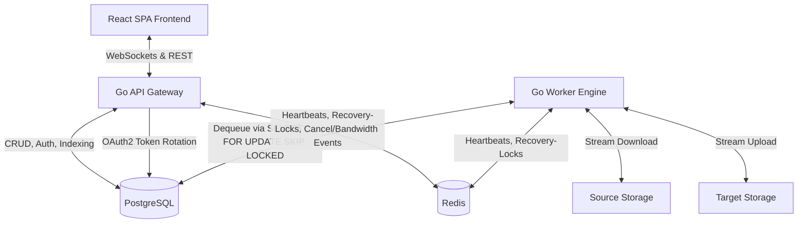

# Clumove – Multi-Cloud Migration Platform (Phase 2 – Multi-Tenancy)

<p align="center">
  
</p>

A high-performance, resilient and privacy-friendly platform for lossless data migration between cloud storage, NAS systems and servers. The system is strictly modular and currently supports **seven storage providers** (Nextcloud, generic WebDAV, Dropbox, Google Drive, S3-compatible, SMB and SFTP) as source/target combinations – complemented by multi-tenancy, TOTP two-factor authentication, a scheduler engine for deferred/recurring migrations, and high security standards.

> 📘 **Deutsche Version:** [README.md](./README.md)

---

## 1. System Architecture & Flow

The overall system is based on a decoupled monorepo design with separate containers for the frontend, API gateway, database, cache and migration worker. Every migration is tied to a user account and isolated.



> **Important:** The task queue runs **natively in PostgreSQL** (`SELECT … FOR UPDATE SKIP LOCKED`). Redis is used **exclusively** for worker heartbeats, distributed recovery locks (`SET NX`), and cancel/bandwidth Pub/Sub events – not as a queue broker.

### Migration Flow Step-by-Step
1. **Registration & Login:** Users create an account (`POST /api/auth/register`) and authenticate (`POST /api/auth/login`). They receive a short-lived JWT access token (HS256, issuer `clumove-api`) plus a longer-lived refresh token in a secure HTTP-only cookie. TOTP two-factor authentication can optionally be enabled. For OAuth2 providers (Dropbox, Google) a separate flow is available via `GET /api/oauth/auth` and `GET /api/oauth/callback`.
2. **Connection Test:** The user enters source and target credentials in the frontend. The API performs a connection test through the respective provider client (`POST /api/migration/connect`). For OAuth providers the stored token is used.
3. **File Browser:** Before indexing, the user can explore source (`POST /api/migration/browse`) and target directories (`POST /api/migration/target/browse`) and create target directories (`POST /api/migration/target/mkdir`).
4. **Indexing (Inventory):** After connection selection, the API gateway recursively scans the selected source paths using a queue-based BFS (cycle-protected, prevents infinite loops on symlink cycles). Every entry found (file, calendar, contact) is created as an individual task with metadata (path, size, resource type, source hash) in PostgreSQL.
5. **Configuration & Start:** The user selects a conflict strategy (`SKIP`, `OVERWRITE`, `RENAME`), target directory, thread count and an optional bandwidth limit. On confirmation, `POST /api/migration/start` begins processing – optionally **deferred** to a later time (`scheduled_time`).
6. **Processing:** Workers dequeue tasks from PostgreSQL via `SELECT … FOR UPDATE SKIP LOCKED`. The degree of parallelism is controlled by the migration's `threads` field. Transfers are streamed (no temporary writes to disk). Thread count and bandwidth limit can be adjusted **during a running migration**.
7. **Real-Time Updates:** During transfer the worker reports progress to the DB. The API gateway pushes it via WebSocket (`GET /api/migration/{id}/ws`, token-secured) to the live dashboard in the browser.
8. **Report:** After completion a CSV report can be downloaded (`GET /api/migration/{id}/report`) containing both failed tasks **and** skipped indexing errors.

---

## 2. Technical Details & Concepts

### 2.1. Resilience & Queue Architecture
Because cloud services frequently suffer connection fluctuations, the backend is built to be extremely robust:
* **PostgreSQL-native queue (at-least-once):** Dequeuing happens directly in PostgreSQL via `SELECT … FOR UPDATE SKIP LOCKED`. A task is atomically moved into the `RUNNING` state. If a worker crashes, `RunWorkerLiveness` resets all orphaned `RUNNING` tasks of that worker back to `PENDING` on restart.
* **Worker Liveness & Distributed Recovery:** Each worker reports its heartbeat via Redis. A scheduler (`RunWorkerLiveness`) detects dead workers and claims their recovery lock atomically via Redis `SET NX` to prevent duplicate recovery.
* **Exponential Backoff:** On a failed transfer the worker reschedules the task with an increasing delay ($10 \times 3^{\text{attempt}}$ seconds, i.e. 10 s, 30 s, 90 s) up to 3 attempts. Permanent errors (e.g. invalid OAuth tokens) skip the retry immediately.
* **Connection-Loss Auto-Pause (`PAUSED_CONNECTION_LOSS`):** If a service is permanently offline, the entire migration pauses itself (`RunConnectionRecoveryScheduler`). The scheduler periodically checks whether servers are reachable again and resumes from the interruption point.
* **Orphaned-Task Recovery:** `RunOrphanedRunningTasksRecovery` detects tasks stuck in `RUNNING` for too long and resets them to `PENDING`.
* **Retry-Failed & Reindex:** `POST /api/migration/{id}/retry-failed` re-queues failed tasks; `POST /api/migration/{id}/reindex` re-runs the indexing phase of a failed migration (e.g. after a WebDAV PROPFIND timeout).

### 2.2. Data Integrity (3-Way Hash Check)
To prevent silent data corruption, every file is verified mathematically:
1. **Source hash:** Determined before transfer via WebDAV PROPFIND (from `OC-Checksums` or `getcontenthash`).
2. **In-memory hash:** An `io.TeeReader` intercepts the data stream during the volatile pass in the worker's RAM and computes the SHA-1 or MD5 hash live.
3. **Target hash:** After upload the hash of the written file is queried from the target server.
4. **Validation:** The task is considered complete only when the hashes are absolutely identical ($\text{Hash}_{\text{source}} \equiv \text{Hash}_{\text{worker}} \equiv \text{Hash}_{\text{target}}$). If the instance provides no hashes, a fallback to file size and timestamp is used.

### 2.3. Supported Storage Providers & OAuth2
The storage subsystem is fully abstracted via the `StorageProvider` interface. Currently supported providers:

| Provider | Protocol | Auth Method | Resource Types |
| :--- | :--- | :--- | :--- |
| **Nextcloud** | WebDAV + OC-Extensions | Username/Password | Files, Calendars (CalDAV), Contacts (CardDAV) |
| **Generic WebDAV** | WebDAV | Username/Password | Files |
| **Dropbox** | Dropbox API v2 | OAuth2 | Files |
| **Google Drive** | Google Drive API v3 | OAuth2 | Files, Calendars (Calendar API), Contacts (People API) |
| **S3-compatible storage** | S3 (Wasabi, MinIO, B2 …) | Access Key / Secret Key | Files |
| **SMB / CIFS** | SMB2/SMB3 (`go-smb2`) | Username/Password | Files |
| **SFTP** | SSH SFTP (`pkg/sftp`) | Username/Password (or key) | Files |

> **SSRF protection (S3):** `insecure=true` endpoints validate literal IPs or `*.local`/`localhost` directly without DNS resolution to prevent DNS-rebinding SSRF attacks. Only literal loopback/private IPs or local domain names are permitted.

The `RunOAuthRotationDaemon` in the API gateway automatically renews OAuth2 refresh tokens in the background before they expire, storing them AES-GCM-encrypted in the database.

### 2.4. Scheduler Engine (Deferred & Recurring Migrations)
The API gateway runs a background daemon (`scheduler.Run`) that checks for due schedules every minute and triggers the linked job. Schedules live in the `schedules` table.
* **One-shot (deferred start):** Using `POST /api/migration/start` with `scheduled_time`, the migration is created in `SCHEDULED` state and a one-time schedule is created. At execution time the scheduler starts indexing with the persisted `selected_paths`/`calendars`/`contacts`.
* **Recurring (cron):** Schedules with a `cron_expression` (validated via `cron.ParseStandard`) recompute their `next_run_at` after each execution.
* **Overlap protection:** Before triggering, `isJobActive` checks whether the linked job is already `RUNNING`/`INDEXING`; if so, it is skipped and (for recurring jobs) only the next run time is advanced.
* **Multi-instance safety:** A Redis `SET NX` lock (`schedule:lock:{id}`, 2-minute TTL) is claimed per schedule so that only one API instance triggers it in a multi-instance deployment.
* **Failure handling:** If triggering fails (linked task deleted, migration not in `SCHEDULED` state), the schedule is deactivated to prevent an infinite retry loop.

### 2.5. Migration Options & Conflict Strategies
The following parameters can be configured when starting a migration:
* **Conflict strategy (`conflict_strategy`):** Determines behavior for already-existing target files:
  * `SKIP` — Existing files are skipped (default).
  * `OVERWRITE` — Existing files are overwritten atomically (upload to temp file, then rename).
  * `RENAME` — The new file is renamed with a unique suffix (up to 100 attempts).
* **Target directory (`target_dir`):** Optional base path in the target storage (default: `/`).
* **Parallelism (`threads`):** Configurable number of parallel file transfers per migration (1–16, default: 4). **Adjustable live** during the migration via `PUT /api/migration/{id}/threads`.
* **Bandwidth limit (`bandwidth_limit_mbps`):** Optional throttling (0–1000 Mbit/s). **Adjustable live** via `PUT /api/migration/{id}/bandwidth`.
* **Control:** `POST /api/migration/{id}/pause`, `/resume`, `/cancel` plus a CSV `/report`.

### 2.6. Account Management & Notifications
* **TOTP two-factor authentication:** Setup (`/api/auth/2fa/setup`), enable (`/api/auth/2fa/enable`), disable and status. 2FA temp tokens may not reach the migration WebSocket.
* **Profile & Security:** Change display name (`PUT /api/auth/me`), change password (`POST /api/auth/change-password`), set/delete avatar.
* **Email change:** Confirmation link to the old address (`POST /api/auth/change-email` + `POST /api/auth/confirm-email-change`).
* **Password reset:** `forgot-password` / `reset-password` (by email, if SMTP configured).
* **System SMTP:** Configurable via `/api/settings/smtp` and testable via `/api/settings/smtp/test`; passwords are stored encrypted.
* **Internationalization (i18n):** The frontend supports `de` (fallback) and `en` via `i18next`/`react-i18next`. All error codes are transmitted machine-readably and localized in the frontend.

### 2.7. Multi-Tenancy & Data Security
* **Session isolation (multi-tenancy):** Migration jobs are tied to a user account. Status, start, pause, cancel and delete endpoints enforce a strict ownership check via JWT middleware; on mismatch they return `403 Forbidden`.
* **User roles:** Three roles: `USER` (default), `AUDITOR` and `ADMIN`.
* **Zero Caching:** File contents flow through volatile RAM buffer streams. No caching is ever written to the migration server's disks.
* **Key Segregation:**
  - `ENCRYPTION_SECRET_KEY`: Exclusively for AES-256-GCM encryption of stored credentials in the DB (derived 32-byte key via SHA-256).
  - `JWT_SECRET_KEY`: Separate and exclusively for cryptographic signing/validation of JWT tokens. The two must **not** be identical – the server refuses to start otherwise.
* **CORS Origin Whitelist & Cookie Security:** Credentials (refresh-token cookie) are only sent to trusted whitelist domains. Unknown origins receive no `Access-Control-Allow-Origin` header.
* **Refresh Token Rotation:** On every refresh the old refresh token is deleted and a new one issued (replay protection).
* **WebSocket Auth:** `/api/migration/{id}/ws` is not behind `AuthMiddleware`; it authenticates via the `Sec-WebSocket-Protocol` token or `?token=` query (latter only over HTTP), verifies ownership and blocks 2FA temp tokens.
* **Rate Limiting:** Public endpoints (login, registration, password reset) are protected by an IP rate limiter.
* **Permanent History & Manual Deletion (Cascading Delete):** Migration history is retained permanently and can be deleted manually. Deleting a migration cascades all related tasks.

---

## 3. Technology Stack

* **Backend (API & Worker):** Go 1.25 as a single Go module with two entrypoints (`cmd/api` and `cmd/worker`). Routing via the Go 1.22 standard HTTP mux (no external router libs).
* **Frontend:** React 19 (TypeScript 6) SPA, bundled with Vite 8.
* **CSS Framework:** Tailwind CSS v4 (integrated via the modern `@tailwindcss/vite` plugin).
* **Icons:** Lucide React.
* **i18n:** `i18next` + `react-i18next` + `i18next-browser-languagedetector` (languages: `de`, `en`).
* **Database:** PostgreSQL 15 (persistence of metadata, users, tasks, schedules, refresh tokens). Also used as the primary queue via `SELECT … FOR UPDATE SKIP LOCKED`.
* **Broker/Coordination:** Redis 7 (worker heartbeats, distributed recovery locks via `SET NX`, Pub/Sub for cancel/bandwidth). Password-protected; **not** exposed on the host network.
* **OAuth2:** Dropbox API v2 and Google Drive/Calendar/Contacts (automatic token rotation in `RunOAuthRotationDaemon`).
* **Orchestration:** Docker Compose with multi-stage Dockerfiles (`dev` and `prod` targets).

---

## 4. Port Allocation & Network Routing

| Service | Container Name | Internal Port | External Host Port | URL / Connection |
| :--- | :--- | :--- | :--- | :--- |
| **Frontend** | `migration-frontend` | `3000` | `3001` | [http://localhost:3001](http://localhost:3001) |
| **API Backend** | `migration-api` | `8000` | `8001` | [http://localhost:8001](http://localhost:8001) |
| **Database** | `migration-postgres` | `5432` | *not exposed* | Internal only (`postgres-db:5432`) |
| **Redis Queue** | `migration-redis` | `6379` | *not exposed* | Internal only, password-protected |
| **Worker** | `migration-worker-1` | – | – | Internal network |

> **Note:** PostgreSQL and Redis are deliberately **not** exposed on the host port to prevent external attacks (e.g. the SLAVEOF attack on 2026-07-08 that wiped the queue).

---

## 5. Quickstart & Deployment

### Prerequisites
- Docker and Docker Compose installed on the host.
- A `.env` file (see [`.env.example`](./.env.example)) with at least `ENCRYPTION_SECRET_KEY` and `JWT_SECRET_KEY` (both generated via `openssl rand -base64 32`, **not identical**).
- If installed on a remote server: open ports `3001` (web interface) and `8001` (API) in the firewall.

### Start the Platform (Development)
```bash
cp .env.example .env   # then fill ENCRYPTION_SECRET_KEY / JWT_SECRET_KEY
docker compose up --build -d
```
This builds the containers, downloads dependencies, initializes the PostgreSQL schema from `db/schema.sql` and starts all services in the background.

### Production
For production use, `docker-compose.prod.yml` is available (optimized builds, `MAX_THREADS`, HTTPS-capable behind a reverse proxy):
```bash
docker compose -f docker-compose.prod.yml up --build -d
```

### Dynamic API Resolution (Frontend)
The frontend auto-detects the API URL (`src/utils/api.ts`):
```typescript
// VITE_API_URL set and not localhost → use directly (production proxy)
// Else: on a custom domain without port → reverse-proxy routing
// Local → port 8001
```
This ensures correct resolution in development (`:8001`), behind a reverse proxy (no port) and with explicit `VITE_API_URL` configuration.

### Scaling Workers
Stateless workers can be scaled horizontally at runtime:
```bash
docker compose up --scale migration-worker=4 -d
```
Pending transfers are distributed atomically across all workers via the PostgreSQL queue.

---

## 6. Environment Variables

| Variable | Purpose | Default |
| :--- | :--- | :--- |
| `ENCRYPTION_SECRET_KEY` | AES-256-GCM key for credentials (32 bytes, Base64). **Required.** | – |
| `JWT_SECRET_KEY` | HMAC key for JWT signatures. **Required, ≠ ENCRYPTION_SECRET_KEY.** | – |
| `DB_USER` / `DB_PASSWORD` | PostgreSQL credentials | `postgres` |
| `DATABASE_URL` | Full DB connection URL | localhost fallback |
| `REDIS_URL` | Redis connection (`redis://:pw@host:6379`) | localhost |
| `REDIS_PASSWORD` | Redis password. **Required** — no default; the API/worker refuse to start with an empty or known-default password. Use a strong, unique value. | – |
| `CORS_ALLOWED_ORIGIN` | Allowed CORS origin for production | – |
| `VITE_ALLOWED_HOSTS` | Allowed hosts for Vite dev server | – |
| `GOOGLE_CLIENT_ID` / `GOOGLE_CLIENT_SECRET` | Google OAuth2 credentials | – |
| `DROPBOX_CLIENT_ID` / `DROPBOX_CLIENT_SECRET` | Dropbox OAuth2 credentials | – |
| `OAUTH_REDIRECT_URI` | Optional OAuth redirect override | auto-detect |
| `INDEXING_TIMEOUT_MINUTES` | Max duration of an indexing run | `60` |
| `WEBDAV_LISTING_TIMEOUT_SECONDS` | Timeout per PROPFIND listing | `120` |
| `MAX_THREADS` | Global max parallelism per worker process | `16` |
| `SMTP_HOST` / `SMTP_PORT` / `SMTP_USERNAME` / `SMTP_PASSWORD` / `SMTP_FROM_EMAIL` | System SMTP for emails | – |

---

## 7. API Overview (Excerpt)

All paths prefixed with `/api`. JSON responses use `writeJSON`. Errors carry **only** a machine-readable `error_code` (localized by the frontend) – never raw `err.Error()` text.

| Method | Path | Protection | Description |
| :--- | :--- | :--- | :--- |
| `POST` | `/auth/register` | public | Registration |
| `POST` | `/auth/login` | public | Login (JWT + refresh cookie) |
| `POST` | `/auth/totp` | public | TOTP code verification (2nd factor) |
| `POST` | `/auth/refresh` | refresh cookie | Token renewal |
| `GET` | `/auth/me` | JWT | Own profile |
| `PUT` | `/auth/me` | JWT | Edit profile (display name) |
| `POST` | `/auth/change-password` | JWT | Change password |
| `GET/POST` | `/auth/2fa/setup` · `/2fa/enable` · `/2fa/disable` · `/2fa/status` | JWT | TOTP management |
| `POST` | `/auth/forgot-password` · `/reset-password` | public | Password reset |
| `POST` | `/auth/change-email` · `/confirm-email-change` | JWT/public | Email change |
| `POST` | `/migration/connect` | JWT | Connection test source + target |
| `POST` | `/migration/browse` · `/target/browse` · `/target/mkdir` | JWT | Directory browser |
| `POST` | `/migration/start` | JWT | Create & start migration (optional `scheduled_time`) |
| `GET` | `/migration` · `/migration/{id}` | JWT | List / status |
| `POST` | `/migration/{id}/pause` · `/resume` · `/cancel` | JWT | Control |
| `POST` | `/migration/{id}/retry-failed` · `/reindex` | JWT | Recovery |
| `PUT` | `/migration/{id}/threads` · `/bandwidth` | JWT | Live adjustment |
| `GET` | `/migration/{id}/report` | JWT | CSV report |
| `GET` | `/schedule` · `/schedule/{id}` · `DELETE /schedule/{id}` | JWT | Schedule management |
| `GET` | `/migration/{id}/ws` | token/query | WebSocket live progress |
| `GET` | `/oauth/auth` · `/oauth/callback` | public | OAuth2 flow |

---

## 8. Project Structure

```
migration/
├── backend/                 # Go module (cmd/api, cmd/worker)
│   ├── cmd/api/             # HTTP gateway, auth, WebSocket, OAuth, scheduler trigger
│   ├── cmd/worker/          # Migration engine (processor, recovery schedulers)
│   └── internal/
│       ├── auth/            # JWT, TOTP, middleware
│       ├── crypto/          # AES-256-GCM encrypt/decrypt
│       ├── db/              # PostgreSQL access, schema migration
│       ├── indexer/         # BFS indexing
│       ├── processor/       # Worker liveness, retry, recovery
│       ├── scheduler/       # Schedule engine (cron, overlap protection)
│       ├── storage/         # StorageProvider implementations + factory
│       └── queue/           # PostgreSQL queue, Redis locks/PubSub
├── frontend/                # React 19 SPA (Vite, Tailwind v4, i18n)
├── db/schema.sql            # DDL (also inline in db.go for auto-migration)
├── docker-compose.yml       # Development stack
├── docker-compose.prod.yml  # Production stack
└── .env.example             # Environment variable template
```

---

## 9. Development (Local, without Docker)

```bash
# Backend (requires Go 1.25 + running PostgreSQL/Redis)
cd backend
go run cmd/api/main.go      # API on :8000
go run cmd/worker/main.go   # Worker

# Frontend (requires Node.js)
cd frontend
npm install
npm run dev                 # Vite dev server on :5173
```

Code quality:
```bash
go vet ./backend/...
npx tsc --noEmit --project frontend/tsconfig.app.json
npx eslint frontend/src
```
