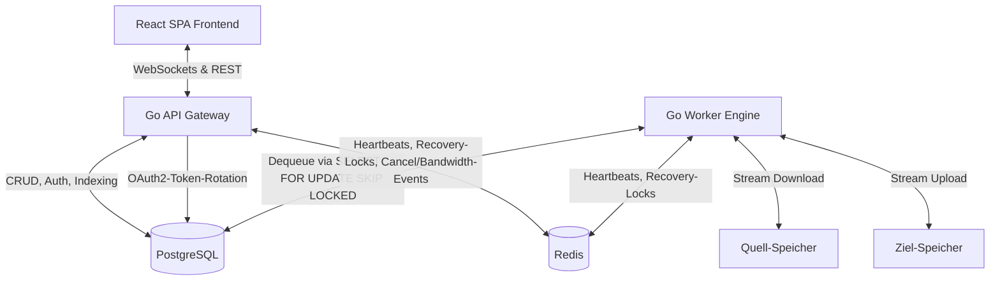

# Clumoove – Multi-Cloud Migrations-Plattform (Phase 2 – Multi-Tenancy)

<p align="center">
  
</p>

Eine hochperformante, resiliente und datenschutzfreundliche Plattform für den verlustfreien Datenumzug zwischen Cloud-Speichern, NAS-Systemen und Servern. Das System ist strikt modular aufgebaut und unterstützt derzeit **sieben Storage-Anbieter** (Nextcloud, generisches WebDAV, Dropbox, Google Drive, S3-kompatibel, SMB und SFTP) als Quell- und Zielkombination – ergänzt durch Multi-Tenancy, Zwei-Faktor-Authentifizierung (TOTP), eine Scheduler-Engine für geplante/periodische Migrationen und hohe Sicherheitsstandards.

> 📘 **Auch auf Englisch verfügbar:** [README.en.md](./README.en.md)

---

## 1. System-Architektur & Ablauf

Das Gesamtsystem basiert auf einem entkoppelten Monorepo-Design mit getrennten Containern für Frontend, API-Gateway, Datenbank, Cache und Migrations-Worker. Jede Migration ist einem Benutzerkonto zugeordnet und isoliert.



> **Wichtig:** Die Aufgaben-Queue läuft **nativ in PostgreSQL** (`SELECT … FOR UPDATE SKIP LOCKED`). Redis wird **ausschließlich** für Worker-Heartbeats, verteilte Recovery-Locks (`SET NX`) sowie Cancel-/Bandwidth-Pub/Sub-Events genutzt – nicht als Queue-Broker.

### Der Migrations-Ablauf Schritt-für-Schritt
1. **Registrierung & Login:** Benutzer erstellen ein Konto (`POST /api/auth/register`) und authentifizieren sich (`POST /api/auth/login`). Sie erhalten einen kurzlebigen JWT-Access-Token (HS256, Issuer `clumoove-api`) sowie einen langlebigeren Refresh-Token in einem sicheren HTTP-Only-Cookie. Optional kann eine TOTP-Zwei-Faktor-Authentifizierung aktiviert werden. Für OAuth2-Anbieter (Dropbox, Google) steht ein separater Flow via `GET /api/oauth/auth` und `GET /api/oauth/callback` bereit.
2. **Verbindungsprüfung:** Der Benutzer gibt die Quell- und Zielzugangsdaten im Frontend ein. Die API führt über den jeweiligen Provider-Client einen Verbindungstest durch (`POST /api/migration/connect`). Für OAuth-Anbieter wird der gespeicherte Token verwendet.
3. **Datei-Browser:** Vor der Indexierung kann der Benutzer Quell- (`POST /api/migration/browse`) und Zielverzeichnisse (`POST /api/migration/target/browse`) erkunden sowie Zielverzeichnisse anlegen (`POST /api/migration/target/mkdir`).
4. **Indexierung (Inventur):** Nach der Verbindungsauswahl scannt das API-Gateway rekursiv die selektierten Quellpfade per Queue-BFS (besuchsgeschützt, verhindert Endlosschleifen bei Symlink-Cycles). Jeder gefundene Eintrag (Datei, Kalender, Kontakt) wird als einzelner Task mit Metadaten (Pfad, Größe, Ressourcentyp, Quell-Hash) in PostgreSQL angelegt.
5. **Konfiguration & Start:** Der Benutzer wählt Konflikt-Strategie (`SKIP`, `OVERWRITE`, `RENAME`), Zielverzeichnis, Thread-Anzahl und optional ein Bandbreiten-Limit. Nach Bestätigung startet `POST /api/migration/start` die Verarbeitung – wahlweise **verzögert** zu einem späteren Zeitpunkt (`scheduled_time`).
6. **Verarbeitung:** Die Worker rufen Tasks per `SELECT … FOR UPDATE SKIP LOCKED` aus PostgreSQL ab. Der Grad der Parallelität wird durch das `threads`-Feld der Migration gesteuert. Übertragungen werden gestreamt (kein temporäres Schreiben auf Festplatte). Threads und Bandbreiten-Limit lassen sich **während einer laufenden Migration** anpassen.
7. **Echtzeit-Updates:** Während der Übertragung meldet der Worker den Fortschritt an die DB. Das API-Gateway pusht ihn via WebSocket (`GET /api/migration/{id}/ws`, Token-gesichert) an das Live-Dashboard im Browser.
8. **Bericht:** Nach Abschluss kann ein CSV-Bericht heruntergeladen werden (`GET /api/migration/{id}/report`), der fehlgeschlagene Tasks **und** übersprungene Indexierungsfehler enthält.

---

## 2. Technische Details & Konzepte

### 2.1. Resilienz & Queue-Architektur
Da Cloud-Dienste oft Verbindungsschwankungen aufweisen, ist das Backend extrem robust gebaut:
* **PostgreSQL-native Queue (at-least-once):** Das Dequeuen erfolgt direkt über PostgreSQL mit `SELECT … FOR UPDATE SKIP LOCKED`. Ein Task wird atomar aus der Tabelle in den Status `RUNNING` versetzt. Stürzt ein Worker ab, setzt `RunWorkerLiveness` beim Neustart alle verwaisten `RUNNING`-Tasks desselben Workers zurück auf `PENDING`.
* **Worker-Liveness & verteiltes Recovery:** Jeder Worker meldet seinen Heartbeat regelmäßig via Redis. Ein Scheduler (`RunWorkerLiveness`) erkennt tote Worker und beansprucht deren Recovery-Lock atomar per Redis `SET NX`, um doppelte Wiederherstellung zu verhindern.
* **Exponential Backoff:** Bricht eine Übertragung ab, plant der Worker den Task mit steigender Wartezeit ($10 \times 3^{\text{attempt}}$ Sekunden, also 10 s, 30 s, 90 s) neu ein (maximal 3 Versuche). Permanente Fehler (z. B. ungültige OAuth-Tokens) überspringen das Retry sofort.
* **Verbindungsausfall-Auto-Pausierung (`PAUSED_CONNECTION_LOSS`):** Ist ein Dienst dauerhaft offline, pausiert die gesamte Migration selbstständig (`RunConnectionRecoveryScheduler`). Der Scheduler prüft in Intervallen, ob die Server wieder antworten, und setzt die Queue am Abbruchpunkt fort.
* **Orphaned-Task-Recovery:** `RunOrphanedRunningTasksRecovery` erkennt Tasks, die seit zu langer Zeit im Status `RUNNING` feststecken, und setzt sie auf `PENDING` zurück.
* **Retry-Failed & Reindex:** Über `POST /api/migration/{id}/retry-failed` werden fehlgeschlagene Tasks erneut eingereiht; `POST /api/migration/{id}/reindex` führt die Indexierungsphase einer fehlgeschlagenen Migration neu aus (z. B. nach einem WebDAV-PROPFIND-Timeout).

### 2.2. Datenintegrität (3-Wege-Hash-Check)
Um Silent Data Corruption zu verhindern, wird jede Datei mathematisch verifiziert:
1. **Quell-Hash:** Wird vor dem Transfer via WebDAV-PROPFIND (aus `OC-Checksums` oder `getcontenthash`) ermittelt.
2. **In-Memory-Hash:** Ein `io.TeeReader` fängt den Datenstrom während des flüchtigen Durchlaufs im Arbeitsspeicher des Workers ab und berechnet live den SHA-1- oder MD5-Hash.
3. **Ziel-Hash:** Nach dem Upload wird der Hash der geschriebenen Datei vom Zielserver abgefragt.
4. **Validierung:** Nur bei absoluter Identität ($\text{Hash}_{\text{Quelle}} \equiv \text{Hash}_{\text{Worker}} \equiv \text{Hash}_{\text{Ziel}}$) gilt der Task als abgeschlossen. Falls die Instanz keine Hashes bereitstellt, erfolgt ein Fallback auf Dateigröße und Zeitstempel.

### 2.3. Unterstützte Storage-Anbieter & OAuth2
Das Storage-Subsystem ist über das `StorageProvider`-Interface vollständig abstrahiert. Aktuell unterstützte Anbieter:

| Anbieter | Protokoll | Auth-Methode | Ressourcentypen |
| :--- | :--- | :--- | :--- |
| **Nextcloud** | WebDAV + OC-Extensions | Benutzername/Passwort | Dateien, Kalender (CalDAV), Kontakte (CardDAV) |
| **Generisches WebDAV** | WebDAV | Benutzername/Passwort | Dateien |
| **Dropbox** | Dropbox API v2 | OAuth2 | Dateien |
| **Google Drive** | Google Drive API v3 | OAuth2 | Dateien, Kalender (Calendar API), Kontakte (People API) |
| **S3-kompatibler Speicher** | S3 (Wasabi, MinIO, B2 …) | Access Key / Secret Key | Dateien |
| **SMB / CIFS** | SMB2/SMB3 (`go-smb2`) | Benutzername/Passwort | Dateien |
| **SFTP** | SSH SFTP (`pkg/sftp`) | Benutzername/Passwort (oder Key) | Dateien |

> **SSRF-Schutz (S3):** `insecure=true`-Endpunkte prüfen vor der Auflösung literal verwendete IPs bzw. `*.local`/`localhost` direkt, ohne DNS-Auflösung, um DNS-Rebinding-SSRF-Angriffe abzuwehren. Es dürfen nur literale Loopback-/Private-IPs oder lokale Domains genutzt werden.

Der `RunOAuthRotationDaemon` im API-Gateway erneuert OAuth2-Refresh-Tokens automatisch im Hintergrund, bevor sie ablaufen, und speichert sie AES-GCM-verschlüsselt in der Datenbank.

### 2.4. Scheduler-Engine (geplante & periodische Migrationen)
Das API-Gateway betreibt einen Hintergrund-Daemon (`scheduler.Run`), der jede Minute fällige Zeitpläne prüft und den verknüpften Job auslöst. Zeitpläne liegen in der `schedules`-Tabelle.
* **One-Shot (verzögerter Start):** Über `POST /api/migration/start` mit `scheduled_time` wird die Migration im Status `SCHEDULED` angelegt und ein einmaliger Zeitplan erzeugt. Zum Zeitpunkt der Ausführung startet der Scheduler die Indexierung mit den persistierten `selected_paths`/`calendars`/`contacts`.
* **Wiederkehrend (cron):** Zeitpläne mit `cron_expression` (validiert via `cron.ParseStandard`) berechnen ihren `next_run_at` nach jeder Ausführung neu.
* **Overlap-Schutz:** Vor dem Auslösen prüft `isJobActive`, ob der verknüpfte Job bereits `RUNNING`/`INDEXING` ist – falls ja, wird übersprungen und (bei wiederkehrenden Jobs) nur die nächste Laufzeit vorgerückt.
* **Multi-Instance-Sicherheit:** Pro Zeitplan wird ein Redis-`SET NX`-Lock (`schedule:lock:{id}`, 2-min-TTL) beansprucht, sodass in einer Mehrinstanz-Umgebung nur eine API-Instanz auslöst.
* **Fehlerbehandlung:** Scheitert das Auslösen (verknüpfter Task gelöscht, Migration nicht im `SCHEDULED`-Zustand), wird der Zeitplan deaktiviert, um eine Endlosschleife zu vermeiden.

### 2.5. Migrationsoptionen & Konfliktstrategien
Beim Start einer Migration können folgende Parameter konfiguriert werden:
* **Konflikt-Strategie (`conflict_strategy`):** Bestimmt das Verhalten bei bereits vorhandenen Zieldateien:
  * `SKIP` — Vorhandene Dateien werden übersprungen (Standard).
  * `OVERWRITE` — Vorhandene Dateien werden atomar überschrieben (Upload in temporäre Datei, dann Rename).
  * `RENAME` — Die neue Datei wird mit einem eindeutigen Suffix umbenannt (bis zu 100 Versuche).
* **Zielverzeichnis (`target_dir`):** Optionaler Basispfad im Zielspeicher (Standard: `/`).
* **Parallelität (`threads`):** Konfigurierbare Anzahl paralleler Dateiübertragungen pro Migration (1–16, Standard: 4). **Live anpassbar** während der Migration via `PUT /api/migration/{id}/threads`.
* **Bandbreiten-Limit (`bandwidth_limit_mbps`):** Optionale Drosselung (0–1000 Mbit/s). **Live anpassbar** via `PUT /api/migration/{id}/bandwidth`.
* **Steuerung:** `POST /api/migration/{id}/pause`, `/resume`, `/cancel` sowie ein CSV-`/report`.

### 2.6. Konto-Verwaltung & Benachrichtigungen
* **TOTP-Zwei-Faktor-Authentifizierung:** Einrichtung (`/api/auth/2fa/setup`), Aktivierung (`/api/auth/2fa/enable`), Deaktivierung und Statusabfrage. 2FA-Temp-Tokens dürfen das Migrations-WebSocket nicht erreichen.
* **Profil & Sicherheit:** Anzeigename ändern (`PUT /api/auth/me`), Passwort ändern (`POST /api/auth/change-password`), Avatar setzen/löschen.
* **E-Mail-Änderung:** Bestätigungs-Link an die alte Adresse (`POST /api/auth/change-email` + `POST /api/auth/confirm-email-change`).
* **Passwort-Reset:** `forgot-password` / `reset-password` (per E-Mail, sofern SMTP konfiguriert).
* **System-SMTP:** Über `/api/settings/smtp` konfigurierbar und per `/api/settings/smtp/test` testbar; Passwörter werden verschlüsselt gespeichert.
* **Internationalisierung (i18n):** Das Frontend unterstützt `de` (Fallback) und `en` via `i18next`/`react-i18next`. Alle Fehlercodes werden maschinenlesbar übertragen und im Frontend lokalisiert.

### 2.7. Multi-Tenancy & Datensicherheit
* **Sitzungsisolation (Multi-Tenancy):** Migrationsjobs sind fest mit einem Benutzerkonto verknüpft. Status-, Start-, Pause-, Cancel- und Lösch-Endpunkte erzwingen eine strikte Eigentumsprüfung via JWT-Middleware; bei Nichtübereinstimmung folgt `403 Forbidden`.
* **Benutzerrollen:** Drei Rollen: `USER` (Standard), `AUDITOR` und `ADMIN`.
* **Zero Caching:** Dateiinhalte fließen flüchtig über RAM-Buffer-Streams. Es erfolgt zu keinem Zeitpunkt ein Cache-Schreiben auf Festplatten des Migrations-Servers.
* **Schlüsseltrennung (Segregation of Keys):**
  - `ENCRYPTION_SECRET_KEY`: Ausschließlich für AES-256-GCM-Verschlüsselung gespeicherter Zugangsdaten in der DB (abgeleiteter 32-Byte-Key via SHA-256).
  - `JWT_SECRET_KEY`: Separat und ausschließlich zur kryptografischen Signierung/Validierung von JWT-Tokens. Beide dürfen **nicht identisch** sein – der Server verweigert den Start sonst.
* **CORS-Origin-Whitelist & Cookie-Sicherheit:** Credentials (Refresh-Token-Cookie) werden nur an vertrauenswürdige Whitelist-Domains übermittelt. Unbekannte Origins erhalten keinen `Access-Control-Allow-Origin`-Header.
* **Refresh-Token-Rotation:** Bei jeder Aktualisierung wird der alte Refresh-Token gelöscht und ein neuer ausgestellt (Replay-Schutz).
* **WebSocket-Auth:** `/api/migration/{id}/ws` ist nicht hinter `AuthMiddleware`; es authentifiziert via `Sec-WebSocket-Protocol`-Token bzw. `?token=`-Query (letzteres nur über HTTP), prüft die Eigentümerschaft und blockiert 2FA-Temp-Tokens.
* **Rate-Limiting:** Öffentliche Endpunkte (Login, Registrierung, Passwort-Reset) sind per IP-Rate-Limiter abgesichert.
* **Permanenter Verlauf & Manuelles Löschen (Cascading Delete):** Die Migrationshistorie bleibt dauerhaft erhalten und kann manuell gelöscht werden. Beim Löschen werden alle zugehörigen Tasks kaskadierend entfernt.

---

## 3. Verwendeter Tech-Stack

* **Backend (API & Worker):** Go 1.25 als einheitliches Go-Modul mit zwei Entrypoints (`cmd/api` und `cmd/worker`). Routing via Go-1.22-Standard-HTTP-Mux (keine externen Router-Libs).
* **Frontend:** React 19 (TypeScript 6) SPA, gebündelt mit Vite 8.
* **CSS-Framework:** Tailwind CSS v4 (integriert über das moderne Vite-Plugin `@tailwindcss/vite`).
* **Icons:** Lucide React.
* **i18n:** `i18next` + `react-i18next` + `i18next-browser-languagedetector` (Sprachen: `de`, `en`).
* **Datenbank:** PostgreSQL 15 (Persistenz von Metadaten, Benutzern, Tasks, Zeitplänen, Refresh-Tokens). Wird gleichzeitig als primäre Queue via `SELECT … FOR UPDATE SKIP LOCKED` genutzt.
* **Broker/Koordination:** Redis 7 (Worker-Heartbeats, verteilte Recovery-Locks via `SET NX`, Pub/Sub für Cancel/Bandwidth). Passwortgeschützt; **nicht** am Host-Netzwerk exponiert.
* **OAuth2:** Dropbox API v2 und Google Drive/Calendar/Contacts (automatische Token-Rotation im `RunOAuthRotationDaemon`).
* **Orchestrierung:** Docker Compose mit Multi-Stage-Dockerfiles (`dev`- und `prod`-Target).

---

## 4. Port-Belegung & Netzwerk-Routing

| Dienst | Container-Name | Interner Port | Externer Host-Port | URL / Verbindung |
| :--- | :--- | :--- | :--- | :--- |
| **Frontend** | `migration-frontend` | `3000` | `3001` | [http://localhost:3001](http://localhost:3001) |
| **API Backend** | `migration-api` | `8000` | `8001` | [http://localhost:8001](http://localhost:8001) |
| **Datenbank** | `migration-postgres` | `5432` | *nicht exponiert* | Nur intern (`postgres-db:5432`) |
| **Redis Queue** | `migration-redis` | `6379` | *nicht exponiert* | Nur intern, passwortgeschützt |
| **Worker** | `migration-worker-1` | – | – | Internes Netzwerk |

> **Hinweis:** PostgreSQL und Redis werden bewusst **nicht** am Host-Port exponiert, um Angriffe von außen (z. B. den SLAVEOF-Angriff vom 2026-07-08, der die Queue gelöscht hat) zu verhindern.

---

## 5. Quickstart & Deployment

### Voraussetzungen
- Docker und Docker Compose auf dem Host-System installiert.
- Eine `.env`-Datei (siehe [`.env.example`](./.env.example)) mit mindestens `ENCRYPTION_SECRET_KEY` und `JWT_SECRET_KEY` (beide via `openssl rand -base64 32` generiert, **nicht identisch**).
- Falls auf einem entfernten Server installiert: Port `3001` (Web-Interface) und `8001` (API) in der Firewall freigeben.

### Plattform starten (Entwicklung)
```bash
cp .env.example .env   # dann ENCRYPTION_SECRET_KEY / JWT_SECRET_KEY befüllen
docker compose up --build -d
```
Dies baut die Container, lädt die Dependencies, initialisiert das PostgreSQL-Schema aus `db/schema.sql` und startet alle Dienste im Hintergrund.

### Produktion
Für den Produktionseinsatz steht `docker-compose.prod.yml` bereit (optimierte Builds, `MAX_THREADS`, HTTPS-fähig hinter Reverse-Proxy):
```bash
docker compose -f docker-compose.prod.yml up --build -d
```

### Dynamische API-Auflösung (Frontend)
Das Frontend erkennt die API-URL automatisch (`src/utils/api.ts`):
```typescript
// VITE_API_URL gesetzt und kein localhost → direkt verwenden (Produktions-Proxy)
// Sonst: auf benutzerdefinierter Domain ohne Port → Reverse-Proxy-Routing
// Lokal → Port 8001
```
Dies stellt korrekte Auflösung in Entwicklung (`:8001`), hinter einem Reverse-Proxy (kein Port) und bei expliziter `VITE_API_URL`-Konfiguration sicher.

### Worker skalieren
Zustandslose Worker können zur Laufzeit horizontal skaliert werden:
```bash
docker compose up --scale migration-worker=4 -d
```
Anstehende Übertragungen werden atomar über die PostgreSQL-Queue auf alle Worker verteilt.

---

## 6. Umgebungsvariablen

| Variable | Zweck | Standard |
| :--- | :--- | :--- |
| `ENCRYPTION_SECRET_KEY` | AES-256-GCM-Schlüssel für Zugangsdaten (32 Byte, Base64). **Pflicht.** | – |
| `JWT_SECRET_KEY` | HMAC-Schlüssel für JWT-Signaturen. **Pflicht, ≠ ENCRYPTION_SECRET_KEY.** | – |
| `DB_USER` / `DB_PASSWORD` | PostgreSQL-Credentials | `postgres` |
| `DATABASE_URL` | Vollständige DB-Verbindungs-URL | localhost-Fallback |
| `REDIS_URL` | Redis-Verbindung (`redis://:pw@host:6379`) | localhost |
| `REDIS_PASSWORD` | Redis-Passwort. **Pflicht** — kein Default; der API/Worker-Start schlägt fehl bei leerem oder bekanntem Standard-Passwort. Starke, einzigartige Werte verwenden. | – |
| `CORS_ALLOWED_ORIGIN` | Erlaubte CORS-Origin für Produktion | – |
| `VITE_ALLOWED_HOSTS` | Erlaubte Hosts für Vite-Dev-Server | – |
| `GOOGLE_CLIENT_ID` / `GOOGLE_CLIENT_SECRET` | Google OAuth2-Credentials | – |
| `DROPBOX_CLIENT_ID` / `DROPBOX_CLIENT_SECRET` | Dropbox OAuth2-Credentials | – |
| `OAUTH_REDIRECT_URI` | Optionaler OAuth-Redirect-Override | auto-detect |
| `INDEXING_TIMEOUT_MINUTES` | Max. Dauer einer Indexierungsläufe | `60` |
| `WEBDAV_LISTING_TIMEOUT_SECONDS` | Timeout pro PROPFIND-Listing | `120` |
| `MAX_THREADS` | Globale Max-Parallelität pro Worker-Prozess | `16` |
| `SMTP_HOST` / `SMTP_PORT` / `SMTP_USERNAME` / `SMTP_PASSWORD` / `SMTP_FROM_EMAIL` | System-SMTP für E-Mails | – |

---

## 7. API-Überblick (Auszug)

Alle Pfade präfixiert mit `/api`. JSON-Antworten nutzen `writeJSON`. Fehler tragen **nur** einen maschinenlesbaren `error_code` (vom Frontend lokalisiert) – niemals rohe `err.Error()`-Texte.

| Methode | Pfad | Schutz | Beschreibung |
| :--- | :--- | :--- | :--- |
| `POST` | `/auth/register` | öffentlich | Registrierung |
| `POST` | `/auth/login` | öffentlich | Login (JWT + Refresh-Cookie) |
| `POST` | `/auth/totp` | öffentlich | TOTP-Code-Prüfung (2. Faktor) |
| `POST` | `/auth/refresh` | Refresh-Cookie | Token-Erneuerung |
| `GET` | `/auth/me` | JWT | Eigenes Profil |
| `PUT` | `/auth/me` | JWT | Profil (Anzeigename) ändern |
| `POST` | `/auth/change-password` | JWT | Passwort ändern |
| `GET/POST` | `/auth/2fa/setup` · `/2fa/enable` · `/2fa/disable` · `/2fa/status` | JWT | TOTP-Verwaltung |
| `POST` | `/auth/forgot-password` · `/reset-password` | öffentlich | Passwort-Reset |
| `POST` | `/auth/change-email` · `/confirm-email-change` | JWT/öffentlich | E-Mail-Änderung |
| `POST` | `/migration/connect` | JWT | Verbindungstest Quelle + Ziel |
| `POST` | `/migration/browse` · `/target/browse` · `/target/mkdir` | JWT | Verzeichnis-Browser |
| `POST` | `/migration/start` | JWT | Migration anlegen & starten (optional `scheduled_time`) |
| `GET` | `/migration` · `/migration/{id}` | JWT | Liste / Status |
| `POST` | `/migration/{id}/pause` · `/resume` · `/cancel` | JWT | Steuerung |
| `POST` | `/migration/{id}/retry-failed` · `/reindex` | JWT | Wiederherstellung |
| `PUT` | `/migration/{id}/threads` · `/bandwidth` | JWT | Live-Anpassung |
| `GET` | `/migration/{id}/report` | JWT | CSV-Bericht |
| `GET` | `/schedule` · `/schedule/{id}` · `DELETE /schedule/{id}` | JWT | Zeitplan-Verwaltung |
| `GET` | `/migration/{id}/ws` | Token/Query | WebSocket Live-Fortschritt |
| `GET` | `/oauth/auth` · `/oauth/callback` | öffentlich | OAuth2-Flow |

---

## 8. Projektstruktur

```
migration/
├── backend/                 # Go-Modul (cmd/api, cmd/worker)
│   ├── cmd/api/             # HTTP-Gateway, Auth, WebSocket, OAuth, Scheduler-Trigger
│   ├── cmd/worker/          # Migrations-Engine (Processor, Recovery-Scheduler)
│   └── internal/
│       ├── auth/            # JWT, TOTP, Middleware
│       ├── crypto/          # AES-256-GCM Encrypt/Decrypt
│       ├── db/              # PostgreSQL-Zugriff, Schema-Migration
│       ├── indexer/         # BFS-Indexierung
│       ├── processor/       # Worker-Liveness, Retry, Recovery
│       ├── scheduler/       # Zeitplan-Engine (cron, Overlap-Schutz)
│       ├── storage/         # StorageProvider-Implementierungen + Factory
│       └── queue/           # PostgreSQL-Queue, Redis-Locks/PubSub
├── frontend/                # React 19 SPA (Vite, Tailwind v4, i18n)
├── db/schema.sql            # DDL (auch inline in db.go für Auto-Migration)
├── docker-compose.yml       # Entwicklungs-Stack
├── docker-compose.prod.yml  # Produktions-Stack
└── .env.example             # Umgebungsvariablen-Vorlage
```

---

## 9. Entwicklung (lokal ohne Docker)

```bash
# Backend (benötigt Go 1.25 + laufende PostgreSQL/Redis)
cd backend
go run cmd/api/main.go      # API auf :8000
go run cmd/worker/main.go   # Worker

# Frontend (benötigt Node.js)
cd frontend
npm install
npm run dev                 # Vite-Dev-Server auf :5173
```

Code-Qualität:
```bash
go vet ./backend/...
npx tsc --noEmit --project frontend/tsconfig.app.json
npx eslint frontend/src
```
