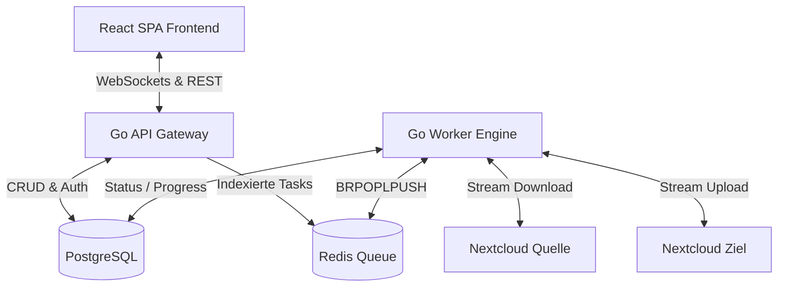

# Multi-Cloud Migrations-Plattform (Phase 2 - Multi-Tenancy)

Eine hochperformante, resiliente und datenschutzfreundliche Plattform für den verlustfreien Datenumzug zwischen Cloud-Speichern. Das System ist strikt modular aufgebaut. Im Fokus steht die Migration von **Nextcloud-zu-Nextcloud** (verschiedene Instanzen/Hoster) über das WebDAV-Protokoll, ergänzt durch Multi-Tenancy-Unterstützung und hohe Sicherheitsstandards.

---

## 1. System-Architektur & Ablauf

Das Gesamtsystem basiert auf einem entkoppelten Monorepo-Design mit getrennten Containern für Frontend, API-Gateway, Datenbank, Cache und Migrations-Worker. Jede Migration ist einer Sitzung zugeordnet und isoliert.



### Der Migrations-Ablauf Schritt-für-Schritt:
1. **Benutzer-Registrierung & Login:** Benutzer erstellen ein Konto (`/api/auth/register`) und authentifizieren sich (`/api/auth/login`). Sie erhalten einen kurzlebigen JWT-Access-Token (15 Minuten) sowie einen langlebigeren Refresh-Token in einem sicheren HTTP-Only-Cookie.
2. **Verbindungsprüfung:** Der Benutzer gibt die Quell- und Zielzugangsdaten im Frontend ein. Die API führt über WebDAV (`PROPFIND`) einen Lese- bzw. Schreibtest durch.
3. **Indexierung (Inventur):** Nach der Verbindungsauswahl scannt das API-Gateway rekursiv die selektierten Quellpfade. Jeder gefundene Dateieintrag wird als einzelner Task mit Metadaten (Pfad, Größe, Quell-Hash) und Benutzerzuordnung in PostgreSQL angelegt.
4. **Queueing:** Sobald das Indexieren abgeschlossen ist, werden die IDs aller offenen Tasks in die Redis-Queue geschrieben.
5. **Verarbeitung:** Die Worker greifen sich die Tasks parallel aus Redis und führen den Stream-Transfer durch.
6. **Echtzeit-Updates:** Während der Übertragung meldet der Worker den Fortschritt an die DB. Das API-Gateway liest diesen aus und pusht ihn via WebSockets (abgesichert per Token) an das Live-Dashboard im Browser.

---

## 2. Technische Details & Konzepte

### 2.1. Resilienz & Queue-Architektur
Da Nextcloud-Instanzen oft hinter restriktiven Firewalls liegen oder Verbindungsschwankungen aufweisen, ist das Backend extrem robust gebaut:
* **Reliable Queue (at-least-once):** Durch Verwendung des Redis-Musters `BRPOPLPUSH` (bzw. `BLMOVE`) wird ein Task beim Dequeuen atomar in eine arbeitsplatzspezifische `processing`-Liste verschoben. Stürzt ein Worker während des Transfers ab, bleibt der Task in der Queue erhalten und wird von einem Recovery-Job automatisch neu eingereiht.
* **Exponential Backoff:** Bricht eine Übertragung ab, markiert der Worker den Task als `FAILED` und plant ihn mit steigender Wartezeit (10s, dann 30s, dann 90s) neu ein (maximal 3 Versuche).
* **Verbindungsausfall-Auto-Pausierung (`PAUSED_CONNECTION_LOSS`):** Ist eine Instanz dauerhaft offline (z. B. Netzwerkfehler, DNS-Ausfall), pausiert die gesamte Migration selbstständig. Ein Hintergrund-Scheduler prüft die Server alle 60 Sekunden. Sobald sie wieder antworten, wird die Queue am Abbruchpunkt fortgesetzt.

### 2.2. Datenintegrität (3-Wege-Hash-Check)
Um Silent Data Corruption zu verhindern, wird jede Datei mathematisch verifiziert:
1. **Quell-Hash:** Wird vor dem Transfer via WebDAV-PROPFIND (aus `OC-Checksums` oder `getcontenthash`) ermittelt.
2. **In-Memory-Hash:** Ein `io.TeeReader` fängt den Datenstrom während des flüchtigen Durchlaufs im Arbeitsspeicher des Workers ab und berechnet live den SHA-1 oder MD5 Hash.
3. **Ziel-Hash:** Nach dem Upload wird der Hash der geschriebenen Datei vom Zielserver abgefragt.
4. **Validierung:** Nur bei absoluter Identität ($\text{Hash}_{\text{Quelle}} \equiv \text{Hash}_{\text{Worker}} \equiv \text{Hash}_{\text{Ziel}}$) gilt der Task als abgeschlossen. Falls die WebDAV-Instanz keine Hashes bereitstellt, erfolgt ein Fallback auf Dateigröße und Zeitstempel.

### 2.3. Multi-Tenancy & Datensicherheit
* **Sitzungsisolation (Multi-Tenancy):** Migrationsjobs sind fest mit einem Benutzerkonto verknüpft. Endpunkte zur Statusabfrage, zum Starten, Abbrechen oder Löschen von Migrationsjobs erzwingen eine strikte Eigentumsprüfung via JWT-Middleware.
* **Zero Caching:** Dateiinhalte fließen flüchtig über RAM-Buffer-Streams. Es erfolgt zu keinem Zeitpunkt ein Cache-Schreiben auf Festplatten des Migrations-Servers.
* **Schlüsseltrennung (Segregation of Keys):**
  - `ENCRYPTION_SECRET_KEY`: Wird ausschließlich für die AES-256-GCM-Verschlüsselung gespeicherter Zugangsdaten in der DB verwendet.
  - `JWT_SECRET_KEY`: Wird separat und ausschließlich zur kryptografischen Signierung und Validierung von JWT-Tokens geladen.
* **CORS Origin Whitelist & Cookie-Sicherheit**: Credentials (wie das `refresh_token`-Cookie) werden nur an vertrauenswürdige Whitelist-Domains (z.B. Vite-Dev-Server oder die per `CORS_ALLOWED_ORIGIN` definierte Host-Domain) übermittelt, um CSRF-Angriffe auszuschließen.
* **Refresh Token Rotation**: Bei jeder Token-Aktualisierung wird der alte Refresh-Token in der Datenbank gelöscht und ein neuer ausgestellt. Dies verhindert Replay-Angriffe bei Token-Diebstahl.
* **Permanenter Verlauf & Manuelles Löschen (Cascading Delete)**: Die Migrationshistorie bleibt dauerhaft erhalten und kann vom Benutzer manuell gelöscht werden. Beim Löschen einer Migration werden alle zugehörigen Tasks über Kaskadierung in der DB rückstandslos entfernt.

---

## 3. Verwendeter Tech-Stack

* **Backend (API & Worker):** Go (Golang) als einheitliches Go-Modul mit zwei Entrypoints (`cmd/api` und `cmd/worker`).
* **Frontend:** React (TypeScript) SPA, gebündelt mit Vite.
* **CSS-Framework:** Tailwind CSS v4 (integriert über das moderne Vite-Plugin).
* **Icons:** Lucide React.
* **Datenbank:** PostgreSQL (Persistenz von Migrations-Metadaten, Benutzern und Tasks).
* **Broker/Queue:** Redis (für flüchtige I/O-Warteschlangen).
* **Orchestrierung:** Docker Compose mit Multi-Stage Dockerfiles.

---

## 4. Port-Belegung & Netzwerk-Routing

Um Port-Konflikte mit bereits installierten lokalen Datenbanken oder Webservern auf dem Host-System zu vermeiden, sind die externen Ports angepasst:

| Dienst | Container-Name | Interner Port | Externer Host-Port | URL / Verbindung |
| :--- | :--- | :--- | :--- | :--- |
| **Frontend** | `migration-frontend` | `3000` | `3001` | [http://localhost:3001](http://localhost:3001) |
| **API Backend** | `migration-api` | `8000` | `8001` | [http://localhost:8001](http://localhost:8001) |
| **Datenbank** | `migration-postgres` | `5432` | `5433` | `localhost:5433` |
| **Redis Queue** | `migration-redis` | `6379` | `6379` | `localhost:6379` |
| **Worker** | `migration-worker-1` | - | - | *Internes Netzwerk* |

---

## 5. Quickstart & Deployment

### Voraussetzungen:
- Docker und Docker Compose auf dem Host-System installiert.
- Falls auf einem entfernten Linux-Server installiert: Port 3001 (Web-Interface) und 8001 (API) müssen in der Firewall freigegeben sein.

### Starten der Plattform:
Führen Sie im Stammverzeichnis des Projekts folgenden Befehl aus:
```bash
docker compose up --build -d
```
*Dieser Befehl baut die Container, lädt die Dependencies, initialisiert das PostgreSQL-Schema aus `db/schema.sql` und startet alle Dienste im Hintergrund.*

### Dynamische API-Auflösung:
Das Frontend verfügt über eine integrierte Erkennungslogik für das API-Routing:
```typescript
// App.tsx
const protocol = window.location.protocol;
const hostname = window.location.hostname;
const API_URL = `${protocol}//${hostname}:8001`;
```
Dies stellt sicher, dass das Frontend (das lokal in Ihrem Browser gerendert wird) die API-Anfragen immer an die korrekte Server-IP (Port 8001) sendet, selbst wenn das Docker-Setup auf einer VM oder einem Cloud-Server ausgeführt wird.

### Skalierung der Worker:
Wenn Sie die Übertragungskapazität erhöhen möchten, können Sie die zustandslosen Worker nahtlos im laufenden Betrieb skalieren:
```bash
docker compose up --scale migration-worker=4 -d
```
Die anstehenden Dateiübertragungen werden thread-sicher und atomar über die Redis-Queue auf alle 4 Worker verteilt.
