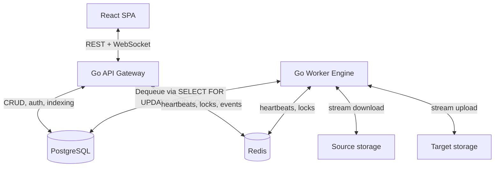

<div align="center">
  
</div>

# Clumoove

**Multi-cloud data migration platform** — a high-performance, resilient and privacy-friendly tool for lossless data
migration between cloud storage providers, NAS systems and servers.

[](#)
[](#)
[](#)
[](#)

Every migration is tied to a user account and fully isolated (multi-tenancy), with TOTP two-factor authentication, a
scheduler engine for deferred and recurring migrations, and a security-first design.

> [!NOTE]
> This README is the quick-start entry point. The complete technical documentation lives in the
> [`docs/`](./docs) folder — architecture, backend, frontend, full API reference, storage providers, database schema,
> security model, deployment and development guides.

## Features

- **Nine storage providers** as any source/target combination: Nextcloud, MagentaCLOUD, generic WebDAV, Dropbox, Google Drive, S3-compatible, SMB/CIFS, SFTP, and Local server sandbox.
- **Sync Engine & Migration Engine** — full support for one-shot/scheduled migrations as well as recurring one-way and two-way folder synchronizations.
- **Connection Profiles** — save and reuse encrypted source/target connection profiles across migrations and sync jobs.
- **Resilient transfer engine** with a PostgreSQL-native task queue (`SELECT … FOR UPDATE SKIP LOCKED`), automatic worker-recovery, exponential backoff, and connection-loss auto-pause.
- **Data integrity** verified by a 3-way hash check (source / in-memory / target) on every transferred file.
- **Scheduler engine** for one-shot (deferred) and recurring (`cron`) migrations and syncs, with overlap protection and multi-instance safety.
- **Live control** — pause, resume, cancel, adjust thread count and bandwidth limit, and watch progress over a token-secured WebSocket feed.
- **Multi-tenancy & security** — per-user isolation, TOTP 2FA, AES-256-GCM credential encryption, JWT key segregation, CORS whitelist, refresh-token rotation and rate limiting.
- **i18n** — the frontend is localized (`de` fallback, `en`) via `i18next`/`react-i18next`.

## Supported providers

| Provider | Protocol | Auth | Resource types |
| :--- | :--- | :--- | :--- |
| **Nextcloud** | WebDAV + OC extensions | User / password | Files, calendars, contacts |
| **MagentaCLOUD** | WebDAV (fixed endpoint) | User / password | Files |
| **Generic WebDAV** | WebDAV | User / password | Files |
| **Dropbox** | Dropbox API v2 | OAuth2 | Files |
| **Google Drive** | Google Drive API v3 | OAuth2 | Files, calendars, contacts |
| **S3-compatible** | S3 (Wasabi, MinIO, B2…) | Access / secret key | Files |
| **SMB / CIFS** | SMB2/SMB3 | User / password | Files |
| **SFTP** | SSH SFTP | User / password (or key) | Files |
| **Local Storage** | Server filesystem sandbox | None (server path) | Files |

See [`docs/05-storage-providers.md`](./docs/05-storage-providers.md) for the provider interface, factory and SSRF
protection details.

## Architecture

Clumoove is a decoupled monorepo: a React SPA, a Go API gateway, a Go migration worker, PostgreSQL and Redis, each in
its own container.



> [!IMPORTANT]
> The task queue runs **natively in PostgreSQL**. Redis is used **only** for worker heartbeats, distributed recovery
> locks (`SET NX`) and cancel/bandwidth Pub/Sub — never as a queue broker.

A migration flows through connect → browse → index (queue-based BFS) → configure → process (streamed, no disk cache) →
live progress → CSV report. The full lifecycle and resilience model are described in
[`docs/01-architecture.md`](./docs/01-architecture.md).

## Quickstart

### Prerequisites

- Docker and Docker Compose
- A `.env` file — copy [`.env.example`](./.env.example) and set at least `ENCRYPTION_SECRET_KEY` and `JWT_SECRET_KEY`
  (each `openssl rand -base64 32`, **must differ**)
- On a remote host, open ports `3001` (web) and `8001` (API)

### Run (development)

```bash
cp .env.example .env   # fill ENCRYPTION_SECRET_KEY / JWT_SECRET_KEY
docker compose -f docker-compose.dev.yml up --build -d
```

Frontend: http://localhost:3001 · API: http://localhost:8001

> [!NOTE]
> `docker-compose.dev.yml` builds all images locally with source mounts for live reload. For production,
> the default `docker-compose.yml` builds the `prod` images locally from source — run
> `docker compose up --build -d`.

> [!TIP]
> Scale workers horizontally at runtime: `docker compose -f docker-compose.dev.yml up --scale migration-worker=4 -d`. Pending transfers are
> distributed atomically across all workers via the PostgreSQL queue.

For production deployment (local builds via `docker-compose.yml`, hardened `docker-compose.prod.yml`, `MAX_THREADS`, HTTPS behind a reverse proxy) and operations
tasks, see [`docs/08-deployment.md`](./docs/08-deployment.md).

## Configuration

Key environment variables (full list in [`docs/08-deployment.md`](./docs/08-deployment.md) and
[`.env.example`](./.env.example)):

| Variable | Purpose |
| :--- | :--- |
| `ENCRYPTION_SECRET_KEY` | AES-256-GCM key for stored credentials. **Required.** |
| `JWT_SECRET_KEY` | HMAC key for JWT signatures. **Required, must differ from `ENCRYPTION_SECRET_KEY`.** |
| `REDIS_PASSWORD` | Redis password. **Required** — no default; the server refuses to start with an empty/known value. |
| `DATABASE_URL` / `DB_USER` / `DB_PASSWORD` | PostgreSQL connection. |
| `GOOGLE_CLIENT_ID` / `GOOGLE_CLIENT_SECRET` | Google OAuth2 credentials (Drive/Calendar/Contacts). |
| `DROPBOX_CLIENT_ID` / `DROPBOX_CLIENT_SECRET` | Dropbox OAuth2 credentials. |
| `MAX_THREADS` | Global max parallelism per worker process (default `16`). |

## Development

Run the stack locally without Docker (requires Go, Node.js, and running PostgreSQL/Redis):

```bash
# Backend
cd backend
go run cmd/api/main.go      # API on :8000
go run cmd/worker/main.go   # worker

# Frontend
cd frontend
npm install
npm run dev                 # Vite dev server on :5173
```

Code quality:

```bash
cd backend && go vet ./...
cd frontend && npx tsc --noEmit --project tsconfig.app.json
cd frontend && npx eslint src
```

See [`docs/09-development.md`](./docs/09-development.md) for conventions and the full local setup.

## Project structure

```
clumoove/
├── backend/                 # Go module (cmd/api, cmd/worker)
│   ├── cmd/api/             # HTTP gateway, auth, WebSocket, OAuth, scheduler trigger
│   ├── cmd/worker/          # Migration engine (processor, recovery schedulers)
│   └── internal/            # auth, crypto, db, indexer, processor, scheduler, storage, queue
├── frontend/                # React 19 SPA (Vite, Tailwind v4, i18n)
├── db/schema.sql            # DDL (also inline in db.go for auto-migration)
├── docker-compose.yml       # Production stack (local prod build)
├── docker-compose.dev.yml   # Development stack (local build)
├── docker-compose.prod.yml  # Production stack (hardened)
└── .env.example             # Environment variable template
```

## Documentation

| Document | Contents |
| :--- | :--- |
| [`docs/01-architecture.md`](./docs/01-architecture.md) | Components, data flow, migration lifecycle, resilience |
| [`docs/02-backend.md`](./docs/02-backend.md) | Go modules and packages, startup logic |
| [`docs/03-frontend.md`](./docs/03-frontend.md) | React SPA, components, routing, i18n, API client |
| [`docs/04-api-reference.md`](./docs/04-api-reference.md) | Full REST/WebSocket endpoint reference |
| [`docs/05-storage-providers.md`](./docs/05-storage-providers.md) | Provider interface, factory, SSRF protection |
| [`docs/06-database.md`](./docs/06-database.md) | Tables, indexes, triggers, auto-migration |
| [`docs/07-security.md`](./docs/07-security.md) | Key segregation, encryption, OAuth, CORS, rate limiting |
| [`docs/08-deployment.md`](./docs/08-deployment.md) | Docker Compose, env vars, scaling, ops |
| [`docs/09-development.md`](./docs/09-development.md) | Local setup, code quality, conventions |

## License

Released under the [MIT License](./LICENSE).
