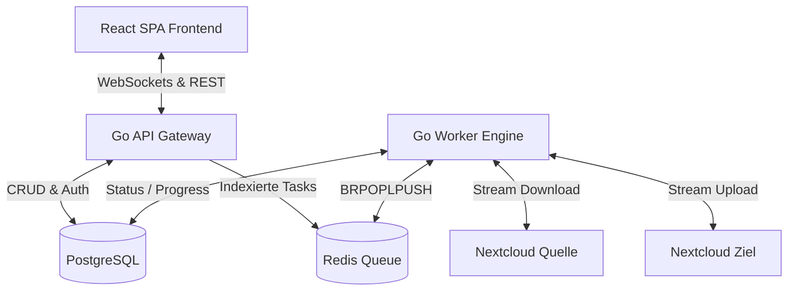

# Clumove - Multi-Cloud Migrations-Plattform (Phase 2 - Multi-Tenancy)

<p align="center">
  
</p>

Eine hochperformante, resiliente und datenschutzfreundliche Plattform für den verlustfreien Datenumzug zwischen Cloud-Speichern. Das System ist strikt modular aufgebaut. Unterstützt werden **Nextcloud**, **generisches WebDAV**, **Dropbox** und **Google Drive** (inkl. Kalender & Kontakte) als Quell- und Zielanbieterkombinationen, ergänzt durch Multi-Tenancy-Unterstützung und hohe Sicherheitsstandards.

---

## 1. System-Architektur & Ablauf

Das Gesamtsystem basiert auf einem entkoppelten Monorepo-Design mit getrennten Containern für Frontend, API-Gateway, Datenbank, Cache und Migrations-Worker. Jede Migration ist einer Sitzung zugeordnet und isoliert.



### Der Migrations-Ablauf Schritt-für-Schritt:
1. **Benutzer-Registrierung & Login:** Benutzer erstellen ein Konto (`POST /api/auth/register`) und authentifizieren sich (`POST /api/auth/login`). Sie erhalten einen kurzlebigen JWT-Access-Token (15 Minuten, HS256, Issuer `clumove-api`) sowie einen langlebigeren Refresh-Token in einem sicheren HTTP-Only-Cookie. Für OAuth2-Anbieter (Dropbox, Google) steht ein separater OAuth-Flow via `GET /api/oauth/auth` und `GET /api/oauth/callback` bereit.
2. **Verbindungsprüfung:** Der Benutzer gibt die Quell- und Zielzugangsdaten im Frontend ein. Die API führt über den jeweiligen Provider-Client einen Verbindungstest durch (`POST /api/migration/connect`). Für OAuth-Anbieter wird der gespeicherte Token verwendet.
3. **Datei-Browser:** Vor der Indexierung kann der Benutzer Quell- (`POST /api/migration/browse`) und Zielverzeichnisse (`POST /api/migration/target/browse`) erkunden sowie Zielverzeichnisse anlegen (`POST /api/migration/target/mkdir`).
4. **Indexierung (Inventur):** Nach der Verbindungsauswahl scannt das API-Gateway rekursiv die selektierten Quellpfade per Queue-BFS (besuchsgeschützt). Jeder gefundene Eintrag (Datei, Kalender, Kontakt) wird als einzelner Task mit Metadaten (Pfad, Größe, Ressourcentyp, Quell-Hash) in PostgreSQL angelegt.
5. **Konfiguration & Start:** Der Benutzer wählt Konflikt-Strategie (`SKIP`, `OVERWRITE`, `RENAME`), Zielverzeichnis und Thread-Anzahl. Nach Bestätigung startet `POST /api/migration/start` die Verarbeitung.
6. **Verarbeitung:** Die Worker rufen Tasks per `SELECT … FOR UPDATE SKIP LOCKED` aus PostgreSQL ab. Der Grad der Parallelität wird durch das `threads`-Feld der Migration gesteuert. Übertragungen werden gestreamt (kein temporäres Schreiben auf Festplatte).
7. **Echtzeit-Updates:** Während der Übertragung meldet der Worker den Fortschritt an die DB. Das API-Gateway pusht ihn via WebSocket (`GET /api/migration/{id}/ws`, Token-gesichert) an das Live-Dashboard im Browser.
8. **Bericht:** Nach Abschluss kann ein CSV-Bericht aller Tasks heruntergeladen werden (`GET /api/migration/{id}/report`).

---

## 2. Technische Details & Konzepte

### 2.1. Resilienz & Queue-Architektur
Da Cloud-Dienste oft Verbindungsschwankungen aufweisen, ist das Backend extrem robust gebaut:
* **PostgreSQL-native Queue (at-least-once):** Anstelle eines Redis-Musters erfolgt das Dequeuen direkt über PostgreSQL mit `SELECT … FOR UPDATE SKIP LOCKED`. Ein Task wird atomar aus der Tabelle in den Status `RUNNING` versetzt. Stürzt ein Worker ab, setzt `RecoverAbandonedTasks` beim Neustart alle verwaisten `RUNNING`-Tasks desselben Workers zurück auf `PENDING`.
* **Worker-Liveness & verteiltes Recovery:** Jeder Worker meldet seinen Heartbeat alle 10 Sekunden via Redis. Ein separater Scheduler (`RunWorkerLiveness`) erkennt tote Worker und beansprucht deren Recovery-Lock atomar per Redis `SET NX`, um doppelte Wiederherstellung zu verhindern.
* **Exponential Backoff:** Bricht eine Übertragung ab, markiert der Worker den Task als `FAILED` und plant ihn mit steigender Wartezeit ($10 \times 3^{\text{attempt}}$ Sekunden, also 10 s, 30 s, 90 s) neu ein (maximal 3 Versuche). Permanente Fehler (z. B. ungültige OAuth-Tokens) überspringen das Retry sofort.
* **Verbindungsausfall-Auto-Pausierung (`PAUSED_CONNECTION_LOSS`):** Ist ein Dienst dauerhaft offline (z. B. Netzwerkfehler, DNS-Ausfall), pausiert die gesamte Migration selbstständig (`RunConnectionRecoveryScheduler`). Der Scheduler prüft alle 60 Sekunden, ob die Server wieder antworten, und setzt die Queue am Abbruchpunkt fort.
* **Orphaned-Task-Recovery:** `RunOrphanedRunningTasksRecovery` erkennt Tasks, die seit mehr als 10 Minuten im Status `RUNNING` feststecken, und setzt sie auf `PENDING` zurück.

### 2.2. Datenintegrität (3-Wege-Hash-Check)
Um Silent Data Corruption zu verhindern, wird jede Datei mathematisch verifiziert:
1. **Quell-Hash:** Wird vor dem Transfer via WebDAV-PROPFIND (aus `OC-Checksums` oder `getcontenthash`) ermittelt.
2. **In-Memory-Hash:** Ein `io.TeeReader` fängt den Datenstrom während des flüchtigen Durchlaufs im Arbeitsspeicher des Workers ab und berechnet live den SHA-1 oder MD5 Hash.
3. **Ziel-Hash:** Nach dem Upload wird der Hash der geschriebenen Datei vom Zielserver abgefragt.
4. **Validierung:** Nur bei absoluter Identität ($\text{Hash}_{\text{Quelle}} \equiv \text{Hash}_{\text{Worker}} \equiv \text{Hash}_{\text{Ziel}}$) gilt der Task als abgeschlossen. Falls die WebDAV-Instanz keine Hashes bereitstellt, erfolgt ein Fallback auf Dateigröße und Zeitstempel.

### 2.3. Unterstützte Speicheranbieter & OAuth2
Das Storage-Subsystem ist über das `StorageProvider`-Interface vollständig abstrakt. Aktuell unterstützte Anbieter:

| Anbieter | Protokoll | Auth-Methode | Ressourcentypen |
| :--- | :--- | :--- | :--- |
| **Nextcloud** | WebDAV + OC-Extensions | Benutzername/Passwort | Dateien, Kalender (CalDAV), Kontakte (CardDAV) |
| **Generisches WebDAV** | WebDAV | Benutzername/Passwort | Dateien |
| **Dropbox** | Dropbox API v2 | OAuth2 (PKCE) | Dateien |
| **Google Drive** | Google Drive API v3 | OAuth2 (PKCE) | Dateien, Kalender (Calendar API), Kontakte (People API) |

Der `RunOAuthRotationDaemon` im API-Gateway erneuert OAuth2-Refresh-Tokens automatisch im Hintergrund, bevor sie ablaufen, und speichert sie verschlüsselt in der Datenbank.

### 2.4. Migrationsoptionen & Konfliktstrategien
Beim Start einer Migration können folgende Parameter konfiguriert werden:
* **Konflikt-Strategie (`conflict_strategy`):** Bestimmt das Verhalten bei bereits vorhandenen Zieldateien:
  * `SKIP` — Vorhandene Dateien werden übersprungen (Standard).
  * `OVERWRITE` — Vorhandene Dateien werden atomar überschrieben (Upload in temporäre Datei, dann Rename).
  * `RENAME` — Die neue Datei wird mit einem eindeutigen Suffix umbenannt (bis zu 100 Versuche).
* **Zielverzeichnis (`target_dir`):** Optionaler Basispfad im Zielspeicher (Standard: `/`).
* **Parallelität (`threads`):** Konfigurierbare Anzahl paralleler Dateiübertragungen pro Migration (Standard: 4, überschreibbar per `MAX_THREADS`-Umgebungsvariable).

### 2.5. Multi-Tenancy & Datensicherheit
* **Sitzungsisolation (Multi-Tenancy):** Migrationsjobs sind fest mit einem Benutzerkonto verknüpft. Endpunkte zur Statusabfrage, zum Starten, Abbrechen oder Löschen von Migrationsjobs erzwingen eine strikte Eigentumsprüfung via JWT-Middleware.
* **Benutzerrollen:** Das System kennt drei Rollen: `USER` (Standard), `AUDITOR` und `ADMIN`.
* **Zero Caching:** Dateiinhalte fließen flüchtig über RAM-Buffer-Streams. Es erfolgt zu keinem Zeitpunkt ein Cache-Schreiben auf Festplatten des Migrations-Servers.
* **Schlüsseltrennung (Segregation of Keys):**
  - `ENCRYPTION_SECRET_KEY`: Wird ausschließlich für die AES-256-GCM-Verschlüsselung gespeicherter Zugangsdaten in der DB verwendet.
  - `JWT_SECRET_KEY`: Wird separat und ausschließlich zur kryptografischen Signierung und Validierung von JWT-Tokens geladen.
* **CORS Origin Whitelist & Cookie-Sicherheit**: Credentials (wie das `refresh_token`-Cookie) werden nur an vertrauenswürdige Whitelist-Domains (z.B. Vite-Dev-Server oder die per `CORS_ALLOWED_ORIGIN` definierte Host-Domain) übermittelt, um CSRF-Angriffe auszuschließen.
* **Refresh Token Rotation**: Bei jeder Token-Aktualisierung wird der alte Refresh-Token in der Datenbank gelöscht und ein neuer ausgestellt. Dies verhindert Replay-Angriffe bei Token-Diebstahl.
* **Permanenter Verlauf & Manuelles Löschen (Cascading Delete)**: Die Migrationshistorie bleibt dauerhaft erhalten und kann vom Benutzer manuell gelöscht werden. Beim Löschen einer Migration werden alle zugehörigen Tasks über Kaskadierung in der DB rückstandslos entfernt.

---

## 3. Verwendeter Tech-Stack

* **Backend (API & Worker):** Go 1.25 als einheitliches Go-Modul mit zwei Entrypoints (`cmd/api` und `cmd/worker`). Routing via Go 1.22 Standard-HTTP-Mux (keine externen Router-Libs).
* **Frontend:** React 19 (TypeScript 6) SPA, gebündelt mit Vite.
* **CSS-Framework:** Tailwind CSS v4 (integriert über das moderne Vite-Plugin `@tailwindcss/vite`).
* **Icons:** Lucide React.
* **Datenbank:** PostgreSQL 15 (Persistenz von Migrations-Metadaten, Benutzern, Tasks und Refresh-Tokens). Wird auch als primäre Queue via `SELECT … FOR UPDATE SKIP LOCKED` genutzt.
* **Broker/Koordination:** Redis 7 (Worker-Liveness-Heartbeats, verteilte Recovery-Locks via `SET NX`). Passwortgeschützt; **nicht** am Host-Netzwerk exponiert.
* **OAuth2:** Dropbox API v2 und Google Drive/Calendar/Contacts API (automatische Token-Rotation im `RunOAuthRotationDaemon`).
* **Orchestrierung:** Docker Compose mit Multi-Stage Dockerfiles.

---

## 4. Port-Belegung & Netzwerk-Routing

Um Port-Konflikte mit bereits installierten lokalen Datenbanken oder Webservern auf dem Host-System zu vermeiden, sind die externen Ports angepasst:

| Dienst | Container-Name | Interner Port | Externer Host-Port | URL / Verbindung |
| :--- | :--- | :--- | :--- | :--- |
| **Frontend** | `migration-frontend` | `3000` | `3001` | [http://localhost:3001](http://localhost:3001) |
| **API Backend** | `migration-api` | `8000` | `8001` | [http://localhost:8001](http://localhost:8001) |
| **Datenbank** | `migration-postgres` | `5432` | *nicht exponiert* | Nur intern (`postgres-db:5432`) |
| **Redis Queue** | `migration-redis` | `6379` | *nicht exponiert* | Nur intern, passwortgeschützt |
| **Worker** | `migration-worker-1` | - | - | *Internes Netzwerk* |

> **Hinweis:** PostgreSQL und Redis werden bewusst **nicht** am Host-Port exponiert, um Angriffe von außen (z. B. den SLAVEOF-Angriff vom 2026-07-08, der die Queue gelöscht hat) zu verhindern.

---

## 5. Quickstart & Deployment

### Voraussetzungen:
- Docker und Docker Compose auf dem Host-System installiert.
- Falls auf einem entfernten Linux-Server installiert: Port 3001 (Web-Interface) und 8001 (API) müssen in der Firewall freigegeben sein.

### Starten der Plattform:
Führen Sie im Stammverzeichnis des Projekts folgenden Befehl aus:
```bash
docker compose up --build -d
```
*Dieser Befehl baut die Container, lädt die Dependencies, initialisiert das PostgreSQL-Schema aus `db/schema.sql` und startet alle Dienste im Hintergrund.*

### Dynamische API-Auflösung:
Das Frontend verfügt über eine integrierte Erkennungslogik für das API-Routing:
```typescript
// App.tsx - getApiUrl()
const envUrl = import.meta.env.VITE_API_URL;
// 1. Wenn VITE_API_URL gesetzt und kein localhost → direkt verwenden (Produktions-Proxy)
if (envUrl && !envUrl.includes('localhost') && !envUrl.includes('127.0.0.1')) {
  return envUrl;
}
// 2. Auf benutzerdefinierter Domain ohne Port → Reverse-Proxy-Routing (kein expliziter Port)
if (hostname !== 'localhost' && (!port || port === '80' || port === '443')) {
  return `${protocol}//${hostname}`;
}
// 3. Lokale Entwicklung → Port 8001
return `${protocol}//${hostname}:8001`;
```
Dies stellt sicher, dass das Frontend die API-Anfragen in Entwicklung (`:8001`), hinter einem Reverse-Proxy (kein Port) und bei expliziter `VITE_API_URL`-Konfiguration korrekt auflöst.

### Skalierung der Worker:
Wenn Sie die Übertragungskapazität erhöhen möchten, können Sie die zustandslosen Worker nahtlos im laufenden Betrieb skalieren:
```bash
docker compose up --scale migration-worker=4 -d
```
Die anstehenden Dateiübertragungen werden thread-sicher und atomar über die Redis-Queue auf alle 4 Worker verteilt.
