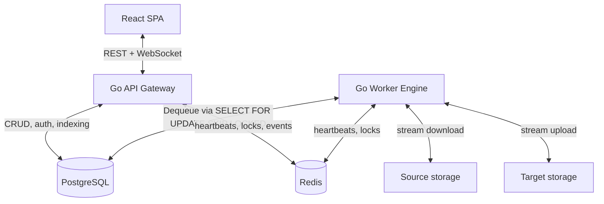

<div align="center">
  
</div>

# Clumoove

**Multi-cloud data migration platform** — a high-performance, resilient and privacy-friendly tool for lossless data
migration between cloud storage providers, NAS systems and servers.

[](#)
[](#)
[](#)
[](#)

Every migration is tied to a user account and fully isolated (multi-tenancy), with TOTP two-factor authentication, a
scheduler engine for deferred and recurring migrations, and a security-first design.

> [!NOTE]
> This README is the quick-start entry point. The complete technical documentation lives in the
> [`docs/`](./docs) folder — architecture, backend, frontend, full API reference, storage providers, database schema,
> security model, deployment and development guides.

## Features

- **Seventeen storage providers** as any source/target combination: Nextcloud, OpenCloud, Seafile, MagentaCLOUD, Koofr, generic WebDAV, Dropbox, Google Drive, Microsoft OneDrive, Strato HiDrive, S3-compatible, SMB/CIFS, SFTP, FTPS, Local server sandbox, Mega (files-only), and Immich (files-only one-time migrations).
- **Sync Engine & Migration Engine** — full support for one-shot/scheduled migrations as well as recurring one-way and two-way folder synchronizations.
- **Connection Profiles** — save and reuse encrypted source/target connection profiles across migrations and sync jobs.
- **Resilient transfer engine** with a PostgreSQL-native task queue (`SELECT … FOR UPDATE SKIP LOCKED`), automatic worker-recovery, exponential backoff, and connection-loss auto-pause.
- **Data integrity** verified by a 3-way hash check (source / in-memory / target) on every transferred file.
- **Scheduler engine** for one-shot (deferred) and recurring (`cron`) migrations and syncs, with overlap protection and multi-instance safety.
- **Live control** — pause, resume, cancel, adjust thread count and bandwidth limit, and watch progress over an authenticated SSE feed.
- **Multi-tenancy & security** — per-user isolation, TOTP 2FA, AES-256-GCM credential encryption, JWT key segregation, CORS whitelist, refresh-token rotation and rate limiting.
- **Central email delivery** — administrators configure one encrypted instance mailer for account emails and optional per-user completion notifications.
- **i18n** — the frontend is localized (`de` fallback, `en`) via `i18next`/`react-i18next`.

## How Clumoove differs from rclone

rclone is an excellent, mature command-line tool for moving and managing cloud files. It supports substantially more
storage backends than Clumoove, and it also provides a web GUI, a remote-control API, one-way `sync`, and two-way
`bisync`. Clumoove does not aim to be a replacement for rclone's universal CLI, mount/serve capabilities, or backend
coverage. Instead, it is a self-hosted application for operating selected migration and synchronization workflows as
durable, multi-user jobs.

| Area | Clumoove | rclone's documented model |
| :--- | :--- | :--- |
| **Primary interface and scope** | Browser-based, account-scoped migration platform with a guided connection, browse, selection, configuration, and execution workflow. | A command-line program for managing cloud storage; its bundled GUI controls a locally running rclone process. |
| **Identity and tenant boundaries** | Separate user accounts, ownership checks on jobs and schedules, roles, TOTP 2FA, JWT sessions, audit log, and encrypted reusable connection profiles. | A configured rclone process operates with the permissions of its host user. Its RC API explicitly has all-or-nothing access and is equivalent to shell access for that user. |
| **Durable execution** | A PostgreSQL task queue persists individual transfer tasks, progress, errors, schedules, and reports. Multiple workers can claim work atomically; liveness, retry, orphan recovery, and connection-loss recovery are built in. | Commands and RC jobs run in a process. The RC documentation describes finished asynchronous jobs as retained for 60 seconds; longer-running automation is normally composed around rclone. |
| **Scheduling and operations** | Deferred and recurring migrations plus interval-based syncs are first-class persisted jobs, with overlap protection, distributed schedule locks, live authenticated progress, downloadable CSV reports, and durable completion notifications. | rclone supports the transfer commands and `bisync`; its `bisync` guide recommends configuring cron for recurring runs. |
| **Migration semantics** | Purpose-built conflict choices (`SKIP`, `OVERWRITE`, `RENAME`), pre-transfer inventory, case-collision handling, selected-path workflows, and a provider-aware three-way source/in-memory/target hash check with safe fallbacks. | Flexible commands and flags support copy, sync, bisync, checksums, filters, metadata, and backend-specific behaviour; verification depends on command options and the capabilities shared by the chosen backends. |
| **Supported data** | Seventeen selected source/target providers, with files plus calendars and contacts for Nextcloud and Google Drive, and an Immich-specific files migration flow. | Far broader storage-backend coverage, primarily exposed through its unified file/object interface. |

This comparison describes product scope rather than claiming that rclone lacks a GUI, API, checksums, or bidirectional
sync. Consult the [rclone usage documentation](https://rclone.org/docs/), [GUI documentation](https://rclone.org/gui/),
[Remote Control API security model](https://rclone.org/rc/#security), and
[bisync guide](https://rclone.org/bisync/) for its current capabilities and operational guidance.

## Supported providers

| Provider | Protocol | Auth | Resource types |
| :--- | :--- | :--- | :--- |
| **Nextcloud** | WebDAV + OC extensions | User / password | Files, calendars, contacts |
| **OpenCloud** | WebDAV (`dav/spaces/`) + TUS 1.0.0 | User / password or Bearer token | Files |
| **Seafile** | Web API v2.1 | User / password or Personal Access Token | Files |
| **MagentaCLOUD** | WebDAV (fixed endpoint) | User / password | Files |
| **Koofr** | Koofr API (fixed public endpoint) | Email / application password | Files |
| **Generic WebDAV** | WebDAV | User / password | Files |
| **Dropbox** | Dropbox API v2 | OAuth2 | Files |
| **Google Drive** | Google Drive API v3 | OAuth2 | Files, calendars, contacts |
| **Microsoft OneDrive** | Microsoft Graph API | OAuth2 | Files |
| **Strato HiDrive** | REST API v2.1 | OAuth2 | Files |
| **S3-compatible** | S3 (Wasabi, MinIO, B2…) | Access / secret key | Files |
| **SMB / CIFS** | SMB2/SMB3 | User / password | Files |
| **SFTP** | SSH SFTP | User / password (or key) | Files |
| **FTPS** | Explicit or implicit FTPS | User / password | Files |
| **Local Storage** | Server filesystem sandbox | None (server path) | Files |
| **Mega** | Mega Cloud Drive API (HTTPS) | Email / password | Files |
| **Immich** | Stable v2 API | Server URL + API key | Files (one-time migrations) |

See [`docs/05-storage-providers.md`](./docs/05-storage-providers.md) for the provider interface, factory and SSRF
protection details.

> [!IMPORTANT]
> The `ftp` provider accepts FTPS only: explicit `ftp://host:21?tls=explicit` or implicit
> `ftps://host:990`. Plain FTP, URL userinfo, certificate-validation bypasses, and custom CAs are not
> supported. Deployments using FTPS need outbound TCP access from API and worker containers to port 21
> or 990 and to the server's configured passive data-port range; no incoming Docker ports are required.

## Architecture

Clumoove is a decoupled monorepo: a React SPA, a Go API gateway, a Go migration worker, PostgreSQL and Redis, each in
its own container.


```mermaid
graph TD
    FE[React SPA] <-->|REST + WebSocket| API[Go API Gateway]
    API <-->|CRUD, auth, indexing| DB[(PostgreSQL)]
    Worker[Go Worker Engine] <-->|Dequeue via SELECT FOR UPDATE SKIP LOCKED| DB
    API <-->|heartbeats, locks, events| Redis[(Redis)]
    Worker <-->|heartbeats, locks| Redis
    Worker <-->|stream download| SRC[Source storage]
    Worker <-->|stream upload| DST[Target storage]
```

> [!IMPORTANT]
> The task queue runs **natively in PostgreSQL**. Redis is used **only** for worker heartbeats, distributed recovery
> locks (`SET NX`) and cancel/bandwidth Pub/Sub — never as a queue broker.

A migration flows through connect → browse → index (queue-based BFS) → configure → process (streamed, no disk cache) →
live progress → CSV report. The full lifecycle and resilience model are described in
[`docs/01-architecture.md`](./docs/01-architecture.md).

## Quickstart

### Prerequisites

- Docker and Docker Compose
- A `.env` file — copy [`.env.example`](./.env.example) and set at least `ENCRYPTION_SECRET_KEY` and `JWT_SECRET_KEY`
  (each `openssl rand -base64 32`, **must differ**)
- On a remote host, open ports `3001` (web) and `8001` (API)

### Run (development)

```bash
cp .env.example .env   # fill ENCRYPTION_SECRET_KEY / JWT_SECRET_KEY
docker compose -f docker-compose.dev.yml up --build -d
```

Frontend: http://localhost:3001 · API: http://localhost:8001

> [!NOTE]
> `docker-compose.dev.yml` builds all images locally with Air-based Go reloads and Vite frontend HMR. For production,
> the default `docker-compose.yml` builds the `prod` images locally from source — run
> `docker compose up --build -d`.

> [!TIP]
> Scale workers horizontally at runtime: `docker compose -f docker-compose.dev.yml up --scale migration-worker=4 -d`. Pending transfers are
> distributed atomically across all workers via the PostgreSQL queue; adjust `POSTGRES_MAX_CONNECTIONS` for the worker count.

For production deployment (local builds via `docker-compose.yml`, `MAX_THREADS`, HTTPS behind a reverse proxy) and operations
tasks, see [`docs/08-deployment.md`](./docs/08-deployment.md).

## Configuration

Key environment variables (full list in [`docs/08-deployment.md`](./docs/08-deployment.md) and
[`.env.example`](./.env.example)):

| Variable | Purpose |
| :--- | :--- |
| `ENCRYPTION_SECRET_KEY` | AES-256-GCM key for stored credentials. **Required.** |
| `JWT_SECRET_KEY` | HMAC key for JWT signatures. **Required, must differ from `ENCRYPTION_SECRET_KEY`.** |
| `REDIS_PASSWORD` | Redis password. **Required** — no default; the server refuses to start with an empty/known value. |
| `DATABASE_URL` / `DB_USER` / `DB_PASSWORD` | PostgreSQL connection. |
| `MAX_THREADS` | Global max parallelism per worker process (default `16`). |
| `TRUSTED_PROXY` | Set to `1`/`true` when a reverse proxy strips client-supplied `X-Forwarded-*` headers; required for correct client-IP accounting and the auto-derived OAuth callback scheme. |

> **OAuth providers** (Google, OneDrive, Dropbox, HiDrive) are configured by an administrator under **Administration → System**, not via environment variables. The OAuth redirect URI is always `<scheme>://<host>/api/oauth/callback` and is shown read-only in the admin UI.

## Development

Run the stack locally without Docker (requires Go, Node.js, and running PostgreSQL/Redis):

```bash
# Backend
cd backend
go run cmd/api/main.go      # API on :8000
go run cmd/worker/main.go   # worker

# Frontend
cd frontend
npm install
npm run dev                 # Vite dev server on :5173
```

Code quality:

```bash
cd backend && go vet ./...
cd frontend && npx tsc --noEmit --project tsconfig.app.json
cd frontend && npx eslint src
```

See [`docs/09-development.md`](./docs/09-development.md) for conventions and the full local setup.

## Project structure

```
clumoove/
├── backend/                 # Go module (cmd/api, cmd/worker)
│   ├── cmd/api/             # HTTP gateway, auth, WebSocket, OAuth, scheduler trigger
│   ├── cmd/worker/          # Migration engine (processor, recovery schedulers)
│   └── internal/            # auth, crypto, db, indexer, processor, scheduler, storage, queue
├── frontend/                # React 19 SPA (Vite, Tailwind v4, i18n)
├── db/schema.sql            # DDL (also inline in db.go for auto-migration)
├── docker-compose.yml       # Production stack (local prod build)
├── docker-compose.dev.yml   # Development stack (local build)
└── .env.example             # Environment variable template
```

## Documentation

| Document | Contents |
| :--- | :--- |
| [`docs/01-architecture.md`](./docs/01-architecture.md) | Components, data flow, migration lifecycle, resilience |
| [`docs/02-backend.md`](./docs/02-backend.md) | Go modules and packages, startup logic |
| [`docs/03-frontend.md`](./docs/03-frontend.md) | React SPA, components, routing, i18n, API client |
| [`docs/04-api-reference.md`](./docs/04-api-reference.md) | Full REST/WebSocket endpoint reference |
| [`docs/05-storage-providers.md`](./docs/05-storage-providers.md) | Provider interface, factory, SSRF protection |
| [`docs/06-database.md`](./docs/06-database.md) | Tables, indexes, triggers, auto-migration |
| [`docs/07-security.md`](./docs/07-security.md) | Key segregation, encryption, OAuth, CORS, rate limiting |
| [`docs/08-deployment.md`](./docs/08-deployment.md) | Docker Compose, env vars, scaling, ops |
| [`docs/09-development.md`](./docs/09-development.md) | Local setup, code quality, conventions |

## License

Released under the [GNU Affero General Public License v3.0 (AGPLv3)](./LICENSE).
