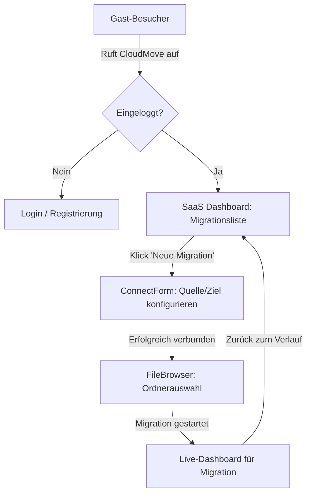

# Product Requirement Document (PRD)
## Multi-Tenancy, Benutzerverwaltung & Login für CloudMove (SaaS-Ready)

Dieses Dokument beschreibt die Anforderungen und das technische Konzept zur Umwandlung der CloudMove Migrations-Plattform von einer Single-User-Anwendung in eine mandantenfähige SaaS-Plattform.

---

## 1. Vision & Zielsetzung

### Status Quo
Aktuell ist CloudMove ein Single-User-System. Jeder Client, der die Weboberfläche aufruft oder API-Aufrufe an das Gateway sendet, operiert im globalen Kontext. Es gibt keine Authentifizierung, und jeder hat Zugriff auf alle Migrationsdaten (inkl. Logs, Statusberichte und Konfigurationen).

### Zielsetzung
Einführung einer sicheren, skalierbaren Mandantenfähigkeit (Multi-Tenancy) auf Basis von Benutzerkonten. 
* **SaaS-Fähigkeit:** Mehrere Kunden können die Plattform unabhängig voneinander nutzen.
* **Datenisolation:** Benutzer dürfen ausschließlich auf ihre eigenen Migrationsdaten, Berichte und Zugangsdaten zugreifen können.
* **Flexible Anmeldung:** Unterstützung für lokale Konten (E-Mail/Passwort) sowie Enterprise-Ready Anmeldungen via OAuth2/OIDC (z. B. Google, Keycloak).
* **Sicherheitskonformität:** Einhaltung der strengen Vorgaben zur Credentials-Verarbeitung (Verschlüsselung, Decrypting im letzten Moment).

---

## 2. Benutzerrollen & Rechte (RBAC)

Um die Plattform flexibel zu halten, wird ein einfaches rollenbasiertes Zugriffskontrollsystem (Role-Based Access Control) eingeführt:

| Rolle | Beschreibung | Zugriffsrechte |
| :--- | :--- | :--- |
| **User (Kunde)** | Standard-Endnutzer der SaaS-Plattform. | Erstellen, Einsehen, Starten und Abbrechen eigener Migrationen. Keine Einsicht in Daten anderer User. |
| **Auditor / Read-Only** | Nutzer mit reinen Leserechten innerhalb eines Mandanten. | Einsehen von Migrationsstatistiken und Berichten. Keine Berechtigung zum Starten oder Löschen von Migrationen. |
| **System-Admin** | Globaler Betreiber der SaaS-Plattform. | Globale System-Statistiken, Benutzerverwaltung, Einsicht in Systemauslastung (Redis-Warteschlangen-Größe, aktive Worker). |

---

## 3. Funktionale Anforderungen

### 3.1 Registrierung & Authentifizierung
* **Lokale Registrierung:** Neuanlage eines Kontos über E-Mail, Passwort und Name. Das Passwort muss mittels `bcrypt` (Kostenfaktor >= 12) gehasht in der Datenbank gespeichert werden.
* **Lokaler Login:** Authentifizierung via E-Mail und Passwort. Bei Erfolg Ausstellung eines kurzlebigen Access Tokens (JWT) und eines langlebigen Refresh Tokens.
* **OAuth2 / OIDC Integration:** 
  - Integration von Drittanbietern (z. B. Google Workspace, Keycloak, GitHub) für Single Sign-On (SSO).
  - Automatisches Provisioning des Accounts beim ersten Login via OAuth2.
* **Session Management:**
  - **Access Token:** JWT (JSON Web Token), Laufzeit 15 Minuten, gespeichert im Arbeitsspeicher des Frontends (oder in einer Session-Variable).
  - **Refresh Token:** Laufzeit 7 Tage, gespeichert in einem **HTTP-only, Secure und SameSite=Strict Cookie**, um XSS-Angriffe zu verhindern.
  - **Logout:** Invalidierung des Refresh-Tokens in der Datenbank und Löschen des Cookies.

### 3.2 Mandantenfähigkeit & Datenisolation
* **Datenbankseitige Trennung:** Jede Tabelle mit benutzerspezifischen Daten (z. B. `migrations`, `tasks`) erhält eine `user_id`-Spalte.
* **API-Sicherheit:** Alle Routen unter `/api/migration/*` werden durch eine Middleware abgesichert, die:
  1. Den JWT-Token aus dem `Authorization: Bearer <Token>` Header extrahiert und kryptografisch validiert.
  2. Die `user_id` aus den JWT-Claims in den Go `context.Context` der Anfrage schreibt.
  3. Bei Abfragen in der Datenbank zwingend die Klausel `WHERE user_id = $1` anhängt.
* **Worker-Sicherheit:**
  - Jobs in der Redis-Queue enthalten nur die `migration_id`.
  - Der Worker fragt die Details zur Migration über die ID ab. Da der Worker als vertrauenswürdiger Systemdienst agiert, holt er die verschlüsselten Zugangsdaten aus der DB, entschlüsselt sie mit dem Master-Key (`crypto.Decrypt`) und führt die Migration durch. Es werden zu keinem Zeitpunkt Plaintext-Credentials in der Redis-Queue abgelegt.

### 3.3 SaaS-Dashboard (Migrations-Verlauf)
* Da ein Benutzer nun mehrere Migrationen durchführen kann, wird die Oberfläche von der reinen "Einzelschritt-Ansicht" zu einem umfassenden Dashboard erweitert:
  - **Übersichtsliste:** Tabelle aller bisherigen Migrationen des Users (inkl. Datum, Quelle, Ziel, Status, Anzahl Dateien).
  - **Detail-Modal / Unterseite:** Detaillierter Live-Fortschritt einer ausgewählten Migration (Äquivalent zum heutigen Dashboard).
  - **Historische Berichte:** Möglichkeit, CSV-Berichte älterer, bereits abgeschlossener Migrationen herunterzuladen.

---

## 4. Datenbank-Schema-Erweiterung (PostgreSQL)

Um Multi-Tenancy zu unterstützen, wird das Schema in [schema.sql](file:///c:/Users/meyer/Development/migration/db/schema.sql) um eine `users` Tabelle erweitert und die Tabelle `migrations` referenziert diese.

```sql
-- 1. Tabelle für die Benutzerverwaltung
CREATE TABLE IF NOT EXISTS users (
    id UUID PRIMARY KEY DEFAULT gen_random_uuid(),
    email TEXT UNIQUE NOT NULL,
    password_hash TEXT, -- NULL bei reinen OAuth2-Usern
    display_name TEXT NOT NULL,
    role TEXT NOT NULL DEFAULT 'USER', -- USER, AUDITOR, ADMIN
    provider TEXT NOT NULL DEFAULT 'local', -- local, google, keycloak
    created_at TIMESTAMP WITH TIME ZONE DEFAULT CURRENT_TIMESTAMP,
    updated_at TIMESTAMP WITH TIME ZONE DEFAULT CURRENT_TIMESTAMP
);

-- Tabelle für Refresh Tokens (zur sicheren Session-Verlängerung)
CREATE TABLE IF NOT EXISTS refresh_tokens (
    token_hash TEXT PRIMARY KEY,
    user_id UUID NOT NULL REFERENCES users(id) ON DELETE CASCADE,
    expires_at TIMESTAMP WITH TIME ZONE NOT NULL,
    created_at TIMESTAMP WITH TIME ZONE DEFAULT CURRENT_TIMESTAMP
);

-- 2. Erweiterung der migrations Tabelle
ALTER TABLE migrations ADD COLUMN IF NOT EXISTS user_id UUID REFERENCES users(id) ON DELETE CASCADE;

-- Index für Performance bei der Abfrage von Benutzer-Migrationen
CREATE INDEX IF NOT EXISTS idx_migrations_user_id ON migrations(user_id);
```

> [!IMPORTANT]
> **Auto-Migration:**
> Die Änderungen müssen in [db.go](file:///c:/Users/meyer/Development/migration/backend/internal/db/db.go) in der Funktion `InitDB` über entsprechende `ALTER TABLE` und `CREATE TABLE` Statements programmatisch abgesichert werden, damit die bestehende Instanz ohne manuellen Eingriff migriert.

---

## 5. API-Architektur & Neue Endpunkte

Die API wird um Authentifizierungs-Endpunkte erweitert und bestehende Endpunkte werden geschützt.

```
/api
├── /auth
│   ├── POST /register        -> Registriert einen neuen lokalen Account
│   ├── POST /login           -> Validiert Credentials, setzt Refresh-Token-Cookie, gibt JWT zurück
│   ├── POST /refresh         -> Validiert Refresh-Token-Cookie, gibt neues JWT zurück
│   ├── POST /logout          -> Invalidiert Refresh-Token, löscht Cookie
│   └── GET  /me              -> Gibt Profil-Infos des aktuell angemeldeten Users zurück
│
├── /migration (JWT Middleware erforderlich)
│   ├── GET  /                -> Listet alle Migrationen des authentifizierten Users
│   ├── POST /connect         -> Testet Verbindung (scoped auf User)
│   ├── POST /browse          -> Quellverzeichnis browsen
│   ├── POST /target/browse   -> Zielverzeichnis browsen
│   ├── POST /start           -> Startet neue Migration (speichert user_id)
│   ├── GET  /{id}            -> Status einer Migration (prüft, ob user_id übereinstimmt)
│   ├── GET  /{id}/report     -> Download des CSV-Berichts (prüft user_id)
│   └── GET  /{id}/ws         -> WebSocket für Live-Updates (validiert JWT beim Verbindungsaufbau)
```

### JWT Payload Struktur (Beispiel)
```json
{
  "sub": "user-uuid-1234-5678",
  "email": "user@example.com",
  "name": "Max Mustermann",
  "role": "USER",
  "exp": 1783459200
}
```

---

## 6. Frontend UI/UX Konzept

Die Benutzeroberfläche wird um Authentifizierungs-Flüsse und eine Migrations-Historie erweitert.

### 6.1 Neuer Login- & Registrierungs-Screen
* **Ästhetik:** Premium Glassmorphismus-Look auf Deep-Navy-Hintergrund, passend zum aktuellen Designsystem.
* **Layout:** Centered-Card Layout mit Wechselslider (Login / Registrierung) und Social-Login Buttons (Google/SSO) am unteren Rand.
* **Validierung:** Direkte clientseitige Validierung (z. B. Passwortstärke, E-Mail-Format) vor dem Submit.

### 6.2 SaaS-Dashboard & Navigationsleiste
* **Header-Erweiterung:**
  - Rechts im Header wird ein Benutzer-Avatar mit Dropdown integriert (Inhalt: Name, E-Mail, Einstellungen, Logout).
* **Migrations-Historie (Startseite nach Login):**
  - Statt direkt das Verbindungsformular anzuzeigen, sieht der Benutzer eine Übersicht seiner bisherigen Migrationen.
  - Ein prominenter Button "Neue Migration starten" führt zum bekannten `ConnectForm`.
  - Statusanzeigen in der Tabelle (z. B. pulsierendes Grün für aktive Migrationen, Grau für abgeschlossene).



---

## 7. Sicherheitskonzept & Compliance

1. **Token-Sicherheit:**
   * JWTs werden kurz gehalten (15 Min.) und sind signiert mit einem HMAC-SHA256 Secret (aus `ENCRYPTION_SECRET_KEY` abgeleitet oder separatem `JWT_SECRET_KEY`).
   * CSRF-Schutz durch die Verwendung von `SameSite=Strict` und `Secure` Flags beim Refresh-Token-Cookie.
2. **Daten-Isolation auf Datenbank-Ebene:**
   * Jeder SQL-Befehl auf tabellenübergreifende Daten muss zwingend `user_id` filtern.
   * **Beispiel Go (API):**
     ```go
     query := `SELECT id, source_url, target_url, status, total_files, processed_files 
               FROM migrations WHERE user_id = $1 ORDER BY created_at DESC`
     rows, err := db.QueryContext(ctx, query, authenticatedUserID)
     ```
3. **Passwort-Hashing:**
   * Verwendung von `golang.org/x/crypto/bcrypt`.
4. **Vermeidung von Credentials-Lecks in Logs & Queue:**
   * Passwörter/Tokens von Nextcloud oder Google Drive werden in der DB via `crypto.Encrypt` verschlüsselt gespeichert.
   * Der Worker liest die Credentials erst im Moment des Verbindungsaufbaus direkt aus der DB und entschlüsselt sie flüchtig im RAM. In der Redis-Queue befindet sich ausschließlich die `migration_id`.

---

## 8. Verifikationsplan & Teststrategie

### 8.1 Automatisierte Tests
* **Unit-Tests (Backend):**
  - Testen der Passwort-Hash-Generierung und -Prüfung.
  - Testen der JWT-Erstellung, -Validierung und -Ablauflogik.
* **Integrationstests (Datenbank & API):**
  - Überprüfung der Tenant-Isolation: Ein Test-User A versucht die Migration von Test-User B über `/api/migration/{id}` aufzurufen -> Erwartetes Ergebnis: `403 Forbidden` oder `404 Not Found`.
  - Testen des Token-Refresh-Mechanismus.
* **Frontend Tests:**
  - Mocking der API-Antworten für Login, abgelaufene Sessions (automatisches Refreshing) und ungültige Logins.

### 8.2 Manuelle Validierung
1. **Registrierung & Login:** Erstellung zweier separater Konten (`user1@test.com` und `user2@test.com`).
2. **Isolations-Test:**
   - User 1 startet eine Migration von Nextcloud nach Local.
   - User 2 loggt sich ein. Im Dashboard von User 2 darf die aktive Migration von User 1 *nicht* auftauchen.
   - Direkter API-Aufruf von User 2 auf `/api/migration/{user1_migration_id}` muss fehlschlagen.
3. **Session-Timeout Test:** Herabsetzen der JWT-Lebensdauer auf 10 Sekunden. Verifizieren, dass das Frontend im Hintergrund nahtlos ein neues JWT über den `/refresh` Endpunkt anfordert, ohne dass der Benutzer ausgweicht oder gestört wird.
