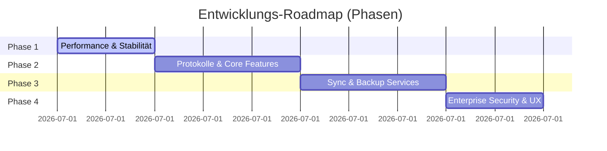

# Master-Roadmap & Feature-Priorisierung

Dieses Dokument beschreibt die strategische Roadmap zur Weiterentwicklung der Multi-Cloud Migrations-Plattform. Die Features sind in vier logische Phasen (Meilensteine) unterteilt, um eine stabile, performante und sichere Entwicklung zu gewährleisten.

---

## 1. Übersicht der Phasen

---

## 2. Detaillierte Priorisierungsmatrix

### Phase 1: Performance, Stabilität & Betriebssicherheit (Must-Haves)
*Diese Phase optimiert die Übertragungsleistung und stellt sicher, dass die Migrationen stabil unter Last laufen und nicht von Drittanbietern blockiert werden.*

*   **[PRD 05: Pre-Flight Check (Dry Run)](file:///c:/Users/meyer/Development/migration/roadmap/prd_05_preflight_check.md)**
    *   *Zweck:* Validierung von Speicherplatz und Berechtigungen vor dem Start.
*   **[PRD 07: Detaillierte Fehlerberichte (Error Reporting)](file:///c:/Users/meyer/Development/migration/roadmap/prd_07_error_reporting.md)**
    *   *Zweck:* Diagnose fehlerhafter Dateitransfers nach dem Durchlauf (CSV-Export).
*   **[PRD 10: Migrationen pausieren und abbrechen](file:///c:/Users/meyer/Development/migration/roadmap/prd_10_pause_cancel.md)**
    *   *Zweck:* Manuelle Steuerung und Abbruch aktiver Übertragungen.
*   **[PRD 12: OAuth Key-Rotation-Daemon](file:///c:/Users/meyer/Development/migration/roadmap/prd_12_oauth_rotation.md)**
    *   *Zweck:* Automatischer Token-Refresh bei langlaufenden Migrationen.
*   **[PRD 15: Multi-Threading & parallele Task-Verarbeitung](file:///c:/Users/meyer/Development/migration/roadmap/prd_15_multithreading.md)**
    *   *Zweck:* Maximierung des Datendurchsatzes mittels paralleler Goroutines im Worker.
*   **[PRD 16: Auto-Throttling Bypass & Rate-Limits](file:///c:/Users/meyer/Development/migration/roadmap/prd_16_throttling_bypass.md)**
    *   *Zweck:* Ausweichen bei API-Drosselungen (HTTP 429) über Backoff und Concurrency-Scaling.

---

### Phase 2: Protokolle & Core Features (Should-Haves)
*Diese Phase erweitert die Konnektivität des Systems um wichtige Industriestandards und optimiert die Kompatibilität zwischen verschiedenen Dateisystemen.*

*   **[PRD 02: S3-kompatibler Objektspeicher](file:///c:/Users/meyer/Development/migration/roadmap/prd_02_s3_storage.md)**
    *   *Zweck:* Anbindung von AWS S3, Backblaze B2, MinIO und Wasabi.
*   **[PRD 06: Core Scheduler Engine](file:///c:/Users/meyer/Development/migration/roadmap/prd_06_schedules.md)**
    *   *Zweck:* Zentrale Infrastruktur zur zeitversetzten Einplanung von Aufgaben.
*   **[PRD 08: Live-Bandbreitenbegrenzung (Traffic Shaping)](file:///c:/Users/meyer/Development/migration/roadmap/prd_08_traffic_shaping.md)**
    *   *Zweck:* Dynamische Drosselung der I/O-Geschwindigkeit zum Schutz der Netzwerke.
*   **[PRD 11: SFTP Storage Integration](file:///c:/Users/meyer/Development/migration/roadmap/prd_11_sftp_storage.md)**
    *   *Zweck:* Import/Export über verschlüsselte SSH-Verbindungen.
*   **[PRD 20: Namenskonvertierung & Dateinamen-Bereinigung](file:///c:/Users/meyer/Development/migration/roadmap/prd_20_name_conversion.md)**
    *   *Zweck:* Automatische Bereinigung inkompatibler Pfade und Lösung von Case-Sensitivity-Kollisionen.

---

### Phase 3: Kontinuierliche Sync- & Backup-Dienste (Nice-to-Haves / Services)
*Erweiterung der Engine von reinen Migrationen hin zu dauerhaften Synchronisations- und Backup-Dienstleistungen.*

*   **[PRD 01: Microsoft Office 365 Integration](file:///c:/Users/meyer/Development/migration/roadmap/prd_01_office365.md)**
    *   *Zweck:* OneDrive/SharePoint und Portierung von Kontakten/Kalendern zu CalDAV/CardDAV.
*   **[PRD 03: Windows-Netzwerkfreigaben (SMB/CIFS)](file:///c:/Users/meyer/Development/migration/roadmap/prd_03_smb_cifs.md)**
    *   *Zweck:* Lokaler NAS- und SMB-Dateizugriff.
*   **[PRD 04: Inkrementelle Migration (Delta Sync)](file:///c:/Users/meyer/Development/migration/roadmap/prd_04_delta_sync.md)**
    *   *Zweck:* Beschleunigung von Transfers durch Abgleich veränderter Hashes/Größen.
*   **[PRD 09: Benachrichtigungen (Webhooks & E-Mail)](file:///c:/Users/meyer/Development/migration/roadmap/prd_09_notifications.md)**
    *   *Zweck:* Proaktive SMTP- und Slack/Teams-Updates bei Statusänderungen.
*   **[PRD 13: Synchronisation von Cloud-Diensten](file:///c:/Users/meyer/Development/migration/roadmap/prd_13_service_sync.md)**
    *   *Zweck:* Fortlaufender One-Way und Two-Way Sync mit Konfliktlösung und persistenten Credentials.
*   **[PRD 14: Backup-Dienst (Snapshot-Backup)](file:///c:/Users/meyer/Development/migration/roadmap/prd_14_backup_service.md)**
    *   *Zweck:* Point-in-Time Versionierung, GFS-Aufbewahrungsregeln und Client-seitige Verschlüsselung.

---

### Phase 4: Enterprise Security, UX & Compliance
*Veredelung der Plattform für den kommerziellen Einsatz (SaaS) und die Integration in Identity-Management-Systeme.*

*   **[PRD 17: Zwei-Faktor-Authentisierung (2FA / MFA)](file:///c:/Users/meyer/Development/migration/roadmap/prd_17_two_factor_auth.md)**
    *   *Zweck:* OTP-Dashboard-Login und Anleitung für App-Passwörter auf Fremdsystemen.
*   **[PRD 18: Berechtigungs-Mapping (Permissions Mapping)](file:///c:/Users/meyer/Development/migration/roadmap/prd_18_permissions_mapping.md)**
    *   *Zweck:* Übersetzung von Berechtigungsstrukturen und Teilen-Eigenschaften zwischen Systemen.
*   **[PRD 19: Metadaten-Erhalt (Metadata Preservation)](file:///c:/Users/meyer/Development/migration/roadmap/prd_19_metadata_preservation.md)**
    *   *Zweck:* Erhalt von Ordner-Tags, Datei-Kommentaren und genauen Erstellungszeitstempeln.
*   **[PRD 21: Echtzeit-Fehlerliste (Real-time Error List)](file:///c:/Users/meyer/Development/migration/roadmap/prd_21_realtime_error_list.md)**
    *   *Zweck:* Live-Fehlerübertragung via WebSockets in das aktive UI-Panel.
*   **[PRD 22: Mehrsprachigkeit (Internationalization / i18n)](file:///c:/Users/meyer/Development/migration/roadmap/prd_22_internationalization.md)**
    *   *Zweck:* Lokalisierung des Dashboards in Deutsch und Englisch.
*   **[PRD 23: OAuth OpenID Connect Login (SSO / OIDC)](file:///c:/Users/meyer/Development/migration/roadmap/prd_23_openid_login.md)**
    *   *Zweck:* Zentrales Login-Management via Keycloak, Okta, Azure AD.

---

## 3. Architektur-Zusammenhänge
Einen genauen Vergleich der unterschiedlichen Systemabläufe und deren Auswirkungen auf die Speicherfristen der Datenbank findest du im separaten Dokument: **[Vergleich der Service-Typen (Migration vs. Sync vs. Backup)](file:///c:/Users/meyer/Development/migration/roadmap/service_comparison.md)**.
